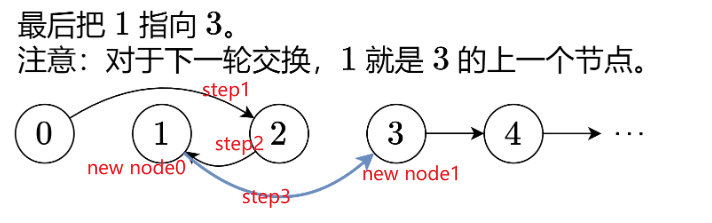

今日任务 

● 链表理论基础 
● 203.移除链表元素 
● 707.设计链表 
● 206.反转链表 

 详细布置 

 链表理论基础 

建议：了解一下链表基础，以及链表和数组的区别 

文章链接：https://programmercarl.com/%E9%93%BE%E8%A1%A8%E7%90%86%E8%AE%BA%E5%9F%BA%E7%A1%80.html

# 203.移除链表元素  

建议： 本题最关键是要理解 虚拟头结点的使用技巧，这个对链表题目很重要。

题目链接/文章讲解/视频讲解：：https://programmercarl.com/0203.%E7%A7%BB%E9%99%A4%E9%93%BE%E8%A1%A8%E5%85%83%E7%B4%A0.html

* 所有链表题都考虑设置头结点。注意.next是节点不是节点值val。
* 删除之后，current.next是即将要判断是否为val的节点，所以不需要再current=current.next
```
def removeElements(self, head: Optional[ListNode], val: int) -> Optional[ListNode]:
        dummy_head = ListNode() # 设置头结点
        dummy_head.next = head
        current = dummy_head

        while current.next:
            if current.next.val == val: # 注意curren.next节点而不是节点的值val
                current.next = current.next.next # 删除之后，current.next是即将要判断是否为val的节点，所以不需要再current=current.next
            else:
                current = current.next
        
        return dummy_head.next
```

# 707.设计链表  

建议： 这是一道考察 链表综合操作的题目，不算容易，可以练一练 使用虚拟头结点

题目链接/文章讲解/视频讲解：https://programmercarl.com/0707.%E8%AE%BE%E8%AE%A1%E9%93%BE%E8%A1%A8.html

* 先在前面定义节点类class ListNode()并背熟。链表类里初始化头结点和self.size
```
class ListNode:
    def __init__(self, val=0, next=None):
        self.val = val 
        self.next = next
```
* addathead：是修改self.dummy.next而不是修改self.dummy,否则影响后续的链表操作
* 初始current是定义在dummy还是第一个节点，需要考虑特殊情况（空链表、头、尾），可以先确定一种current写出来再考虑，无法实现则换另一种
```
def get(self, index: int) -> int:
    if index < 0 or index >= self.size: return -1

    # 以第一个节点为current。如果以头结点为current，则无法返回index=0时的节点值，因为range(0)不会执行循环
    current = self.dummy.next 
    for i in range(index):
        current = current.next
    return current.val
```
```
def addAtTail(self, val: int) -> None:
    # 以头节点为current。如果链表为空，以“第一个节点”（Null）为current的话，range(self.size-1)越界
    current = self.dummy 
    for i in range(self.size):
        current = current.next
    current.next = ListNode(val)
    self.size += 1 
```

# 206.反转链表 

建议先看我的视频讲解，视频讲解中对 反转链表需要注意的点讲的很清晰了，看完之后大家的疑惑基本都解决了。

题目链接/文章讲解/视频讲解：https://programmercarl.com/0206.%E7%BF%BB%E8%BD%AC%E9%93%BE%E8%A1%A8.html 

* pre存放新指向的节点，cur存放当前节点，temp存放下一个节点（因为cur修改之后找不到后一个节点）。初始化pre为None作为新链表的尾节点的next
* cur来到尾节点时，仍需要把尾节点的指针反转，所以循环操作要包括尾节点。最后一轮结束时，要判断哪个变量指向头结点
* 存、改、移动pre、移动cur。cur最后再移动

# 24.两两交换链表中的节点

* 灵神的题解更好理解

* 0是头结点，1是交换节点，2是交换节点，3是交换对后一个节点(用于暂存)
* 边界条件是1、2节点都得存在.
* 0指向2、2指向1、1指向3。
* 原2是下一次循环的0，原3是下一次循环的1。注意步进更新时，哪个节点最靠近
```
def swapPairs(self, head: Optional[ListNode]) -> Optional[ListNode]:

        dummy = ListNode(next=head) # 新建头结点
        node0 = dummy
        node1 = head

        while node0.next and node0.next.next:
            # 2、3还没有定义，在修改前先定义
            node2 = node1.next
            node3 = node2.next

            # 开始操作
            node0.next = node2 # 0指向2
            node2.next = node1 # 2指向1
            node1.next = node3 # 1指向3

            # 步进更新0、1
            node0 = node1 # 上面操作之后，最靠近下一轮交换对的节点是node1
            node1 = node3
        return dummy.next
```
# 19.删除链表的倒数第N个节点
* 扫两趟：先遍历到尾节点，然后倒数回来到待删节点的前一个
* 扫一趟：人工制造快慢指针的指定间隔，两个指针同时移动。当快指针到尾部的时候，慢指针正好在待删节点的前一个。比如倒数第3个要删掉，慢指针在倒数第4个，快指针在尾节点，快指针比慢指针多走了3步.
* 在最后判断slow是否还在头结点，如果是，说明删除的是第一个节点，不能返回原head，因为head是被删掉的节点，应该返回头结点.next

```
def removeNthFromEnd(self, head: Optional[ListNode], n: int) -> Optional[ListNode]:
        

        dummy = ListNode(next=head)
        fast,slow = dummy,dummy

        # 人为制造两个指针的间隔
        for i in range(n):
            fast = fast.next
        # 两个指针同时后移直到快指针在尾节点
        while fast.next:
            fast = fast.next
            slow = slow.next
         # 删节点
        slow.next = slow.next.next

        # 待删节点是第一个节点的，特殊处理
        if slow == dummy: return slow.next

        return head
```


