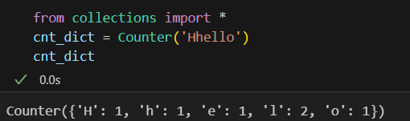
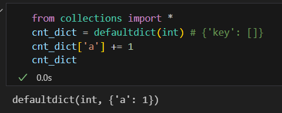

第三章 哈希表part01

 今日任务 

● 哈希表理论基础 
● 242.有效的字母异位词 
● 349. 两个数组的交集 
● 202. 快乐数
● 1. 两数之和   

 详细布置 

 哈希表理论基础 

建议：大家要了解哈希表的内部实现原理，哈希函数，哈希碰撞，以及常见哈希表的区别，数组，set 和map。  

什么时候想到用哈希法，当我们遇到了**要快速判断一个元素是否出现集合里**的时候，就要考虑哈希法。  这句话很重要，大家在做哈希表题目都要思考这句话。 

文章讲解：https://programmercarl.com/%E5%93%88%E5%B8%8C%E8%A1%A8%E7%90%86%E8%AE%BA%E5%9F%BA%E7%A1%80.html  


# 242.有效的字母异位词 

建议： 这道题目，大家可以感受到 数组 用来做哈希表 给我们带来的遍历之处。 

题目链接/文章讲解/视频讲解： https://programmercarl.com/0242.%E6%9C%89%E6%95%88%E7%9A%84%E5%AD%97%E6%AF%8D%E5%BC%82%E4%BD%8D%E8%AF%8D.html  


- __ASCII码__：

    - 7位编码（共128个字符）
    - 仅支持基本拉丁字母、数字和英式标点符号
    - 无法表示非英语字符（如中文、阿拉伯文等）

- __Unicode码__：（python内置函数ord( )）

    - 32位编码（理论可表示超过100万个字符）
    - 支持全球所有语言的字符
    - 包含ASCII字符集（前128个码点与ASCII完全一致）
    - 实际存储采用UTF-8/UTF-16等变长编码方案

- ‌ __Counter__ ‌：用于计数哈希对象的字典子类


- __defaultdict__: 自动创建默认容器



# 349. 两个数组的交集 

建议：本题就开始考虑 什么时候用set 什么时候用数组，本题其实是使用set的好题，但是后来力扣改了题目描述和 测试用例，添加了 0 <= nums1[i], nums2[i] <= 1000 条件，所以使用数组也可以了，不过建议大家忽略这个条件。 尝试去使用set。 

题目链接/文章讲解/视频讲解：https://programmercarl.com/0349.%E4%B8%A4%E4%B8%AA%E6%95%B0%E7%BB%84%E7%9A%84%E4%BA%A4%E9%9B%86.html  

- 用set() & set()

# 202. 快乐数 

建议：这道题目也是set的应用，其实和上一题差不多，就是 套在快乐数一个壳子 

题目链接/文章讲解：https://programmercarl.com/0202.%E5%BF%AB%E4%B9%90%E6%95%B0.html  

- 注意可能会出现永远循环，即新数出现过，需要根据这个设置循环终止条件```while n not in record```

```Python
def isHappy(self, n: int) -> bool:
    record = [] #存放每一轮的n
    
    while n not in record: # 仅当n没有被计算过时
        record.append(n)
        sum_ =  sum([int(s)**2 for s in str(n)])
        if sum_ == 1 : return True
        n = sum_
    
    return False
```

# 1. 两数之和 

建议：本题虽然是 力扣第一题，但是还是挺难的，也是 代码随想录中 数组，set之后，使用map解决哈希问题的第一题。 

建议大家先看视频讲解，然后尝试自己写代码，在看文章讲解，加深印象。 

题目链接/文章讲解/视频讲解：https://programmercarl.com/0001.%E4%B8%A4%E6%95%B0%E4%B9%8B%E5%92%8C.html 

- 每遍历一个数，就存一个键值对“数”:"数的下标"
- 注意，先判断不存在需要的数之后才能存当前的数。如果先存再判断，会出现当需要的数==当前的数时，直接返回

```
def twoSum(self, nums: List[int], target: int) -> List[int]:

    mapping = {}
    for i,n in enumerate(nums):
        needed_num = target-n
        if needed_num in mapping.keys():
            return [i,mapping[needed_num]]
        mapping[n] = i # 先判断不含有再存
    return
```


