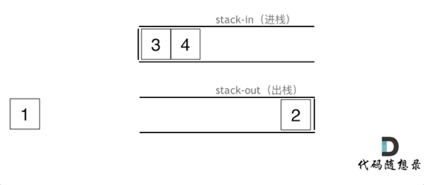

 第五章 栈与队列part01

理论基础 

了解一下 栈与队列的内部实现机制，文中是以C++为例讲解的。 

文章讲解：https://programmercarl.com/%E6%A0%88%E4%B8%8E%E9%98%9F%E5%88%97%E7%90%86%E8%AE%BA%E5%9F%BA%E7%A1%80.html   

# 232.用栈实现队列 

大家可以先看视频，了解一下模拟的过程，然后写代码会轻松很多。

题目链接/文章讲解/视频讲解：https://programmercarl.com/0232.%E7%94%A8%E6%A0%88%E5%AE%9E%E7%8E%B0%E9%98%9F%E5%88%97.html   



```Python
class MyQueue:
    # 一个进栈用于存放新进元素，一个出栈用于实现出栈栈头元素
    def __init__(self):
        self.stack_in = []
        self.stack_out = []

    def push(self, x: int) -> None:
        self.stack_in.append(x)

    def pop(self) -> int:
        if not self.stack_out: # 出栈为空，先从进栈中逐个输出到出栈
            while self.stack_in:
                self.stack_out.append(self.stack_in.pop())
            return self.stack_out.pop()
        else:
            return self.stack_out.pop()

    def peek(self) -> int:
        peek =  self.pop()
        self.stack_out.append(peek)
        return peek 

    def empty(self) -> bool:
        return not (self.stack_in or self.stack_out)
```
# 225. 用队列实现栈 

可能大家惯性思维，以为还要两个队列来模拟栈，其实只用一个队列就可以模拟栈了。 

建议大家掌握一个队列的方法，更简单一些，可以先看视频讲解

题目链接/文章讲解/视频讲解：https://programmercarl.com/0225.%E7%94%A8%E9%98%9F%E5%88%97%E5%AE%9E%E7%8E%B0%E6%A0%88.html  

- deque(): 双头队列，和list类似，有remove(元素)、insert(下标，元素)、append()、appendleft()、pop()、popleft()方法
- 队列先进先出，要取队尾元素，可以把队首元素依次入队，直到队尾元素在队头，取出后再次得到原来的序列

```Python
class MyStack:
    # 出队尾：队首依次入队直到队尾在队首，取出，剩余序列保持原来的顺序

    def __init__(self):
        self.que = deque() # deque()是collections中的标准容器，双头队列，两头都有内置操作方法
        
    def push(self, x: int) -> None:
        self.que.append(x)
        
    def pop(self) -> int:
        if not self.que:
            return None
        for i in range(len(self.que)-1):
            self.push(self.que.popleft())
        return self.que.popleft()

    def top(self) -> int:
        top = self.pop()
        self.push(top)
        return top

    def empty(self) -> bool:
        return not self.que
```

# 20. 有效的括号 

讲完了栈实现队列，队列实现栈，接下来就是栈的经典应用了。 

大家先自己思考一下 有哪些不匹配的场景，在看视频 我讲的都有哪些场景，落实到代码其实就容易很多了。

题目链接/文章讲解/视频讲解：https://programmercarl.com/0020.%E6%9C%89%E6%95%88%E7%9A%84%E6%8B%AC%E5%8F%B7.html  

- 就近匹配用栈
- 注意第一轮无论是什么括号都要入栈，否则stack[-1]越界

```Python
def isValid(self, s: str) -> bool:
    stack = []
    match = {'(':')','{':'}','[':']'}
    for i in s:
        if i in match.keys() or not stack: # 是左括号则入栈;栈为空也入栈
            stack.append(i)
        elif match.get(stack[-1],0) == i: # 是能和栈顶匹配的右括号则出栈栈顶
            stack.pop()
        elif match.get(stack[-1],0) != i: # 是匹配不了的右括号则说明字符串无效
            return False
    return not stack
```


# 1047. 删除字符串中的所有相邻重复项 

栈的经典应用。 

要知道栈为什么适合做这种类似于爱消除的操作，因为栈帮助我们记录了 遍历数组当前元素时候，前一个元素是什么。

题目链接/文章讲解/视频讲解：https://programmercarl.com/1047.%E5%88%A0%E9%99%A4%E5%AD%97%E7%AC%A6%E4%B8%B2%E4%B8%AD%E7%9A%84%E6%89%80%E6%9C%89%E7%9B%B8%E9%82%BB%E9%87%8D%E5%A4%8D%E9%A1%B9.html  

- 注意：每次删除的是两个相邻的相同字符，不是一串相邻字符，所以适合用栈
  

```Python
def removeDuplicates(self, s: str) -> str:  
    
    stack = []
    for i in s[:]:
        if not stack: # 空栈时要把当前元素放入并进入下一轮，否则无法取到stack[-1]
            stack.append(i)
            continue
        
        if i == stack[-1]:
            stack.pop()
        else:
            stack.append(i)
    return "".join(stack)
```


