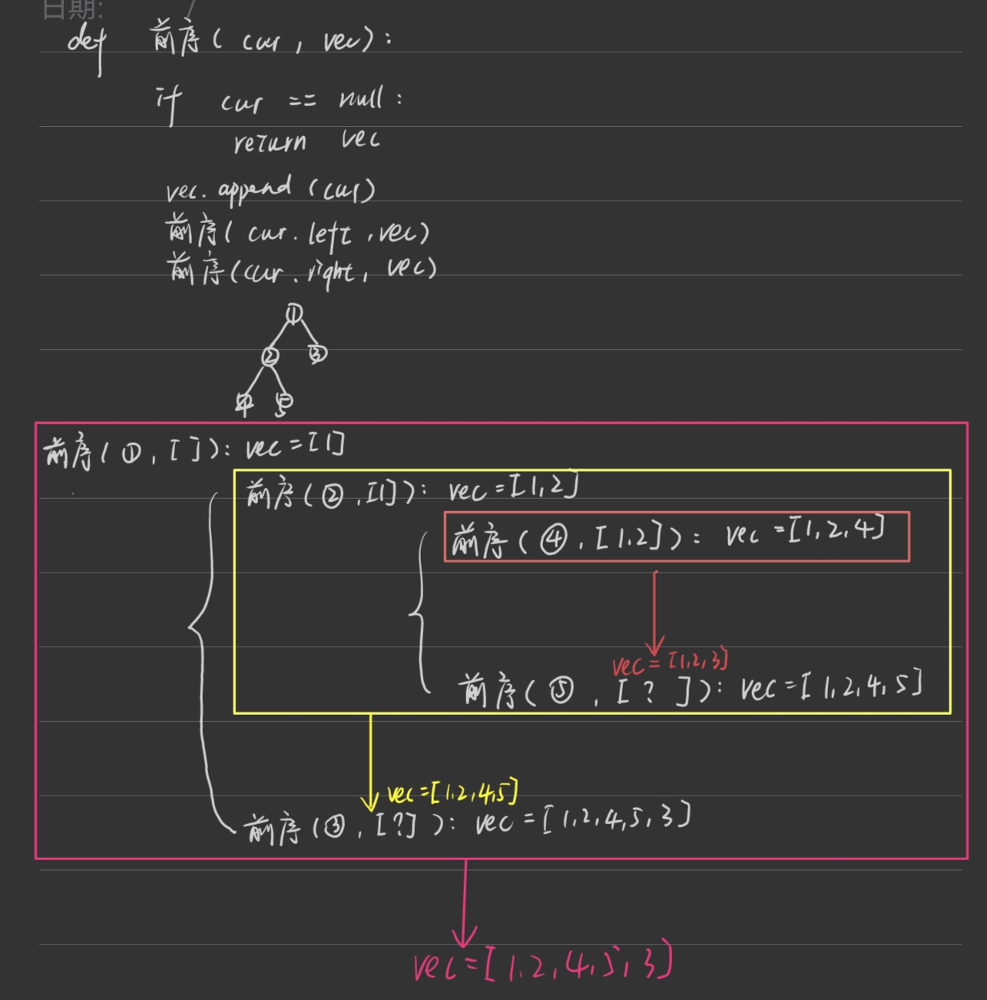
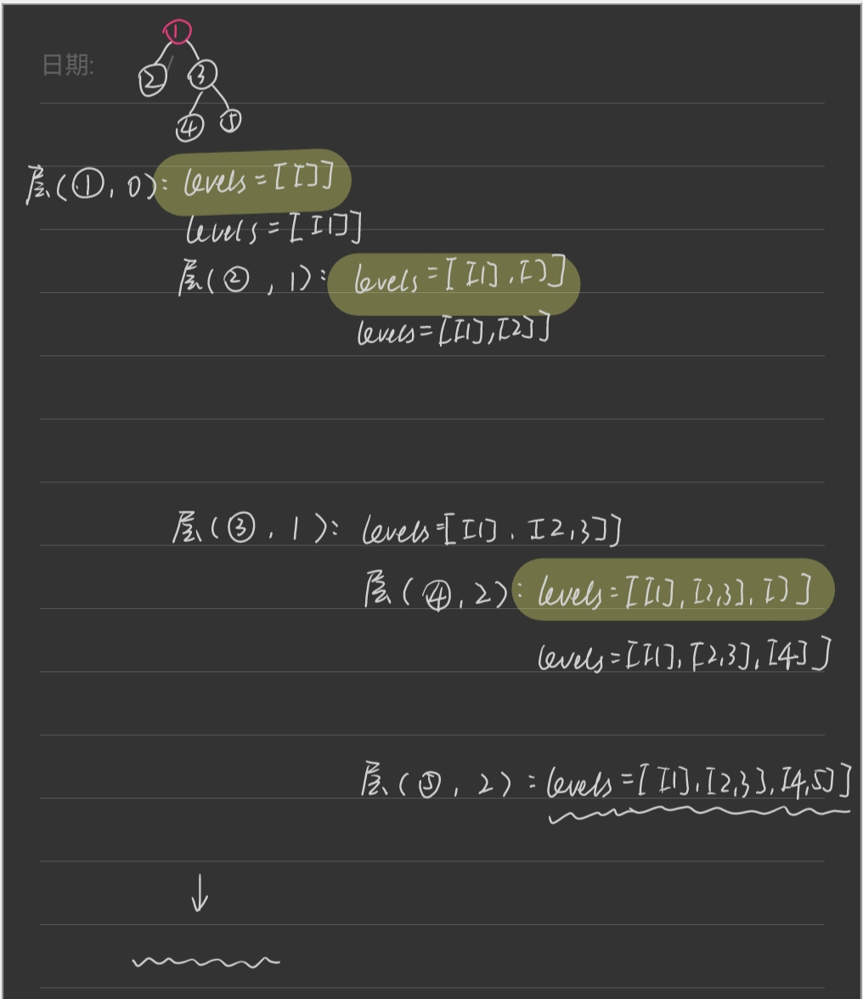

第六章 二叉树part01
 
# 理论基础 

需要了解 二叉树的种类，存储方式，遍历方式 以及二叉树的定义 

文章讲解：https://programmercarl.com/%E4%BA%8C%E5%8F%89%E6%A0%91%E7%90%86%E8%AE%BA%E5%9F%BA%E7%A1%80.html  

- 节点类的定义要背熟
```Python
class TreeNode:
    def __init__(self, val, left = None, right = None):
        self.val = val
        self.left = left
        self.right = right
```

# 递归遍历 （必须掌握）

二叉树的三种递归遍历掌握其规律后，其实很简单 

题目链接/文章讲解/视频讲解：https://programmercarl.com/%E4%BA%8C%E5%8F%89%E6%A0%91%E7%9A%84%E9%80%92%E5%BD%92%E9%81%8D%E5%8E%86.html  

- 确定递归函数的参数和返回
- 确定终值条件
- 确定单层实现的逻辑

```Python
class Solution:
    def preorderTraversal(self, root: Optional[TreeNode]) -> List[int]:
        
        # 定义递归函数
        def traveral(cur,result):
            if cur == None:
                return result
            # 先记录根节点
            result.append(cur.val)
            # 左子树
            traveral(cur.left,result)
            traveral(cur.right,result)
        
        result = []
        traveral(root,result)
        
        return result
```
```Python
# 中序
def traveral(cur,result):
    if cur == None:
        return result
    # 左子树
    traveral(cur.left,result)
    # 根节点
    result.append(cur.val)
    # 右子树
    traveral(cur.right,result)
```
```Python
# 后序
def traveral(cur,result):
    if cur == None:
        return result
    # 左子树
    traveral(cur.left,result)
    # 右子树
    traveral(cur.right,result)
    # 根节点
    result.append(cur.val)
```

# 迭代遍历 （基础不好的录友，迭代法可以放过）

题目链接/文章讲解/视频讲解：https://programmercarl.com/%E4%BA%8C%E5%8F%89%E6%A0%91%E7%9A%84%E8%BF%AD%E4%BB%A3%E9%81%8D%E5%8E%86.html  

## 前序
- 利用栈迭代
- 先放入根节点，要出栈实现“左右”，则要按“右左”入栈
```Python
def preorderTraversal(self, root: Optional[TreeNode]) -> List[int]:

    # 空树单独处理
    if not root: return []

    stack = [root]
    result = []
    while stack:
        # 先处理根
        cur = stack.pop()
        result.append(cur.val)
        # 入栈右子树
        if cur.right: stack.append(cur.right)
        # 入栈左子树
        if cur.left: stack.append(cur.left)
    return resul
```

## 后序
- 利用栈迭代
- 要实现“左右根”的后序遍历，可以考虑“根右左”遍历然后倒序输出。
- “根右左”的实现类比前序便利，先放入根，再入栈左，再入栈右，然后依次出栈处理
```Python
def postorderTraversal(self, root: Optional[TreeNode]) -> List[int]:
    if root == None: return []
    
    stack = [root]
    result = [] 
    while stack:
        cur = stack.pop()
        result.append(cur.val)
        if cur.left: stack.append(cur.left)
        if cur.right: stack.append(cur.right)
    return result[::-1]
```
## 中序
- 从根节点开始，把所有的“左子树”顶入栈
- 每次出栈一棵“左子树”，记录，然后当前节点设为当前节点的右子树。每次出栈"左子树"后，如果它有右子树，那“左子树”其实是中节点，先记录这个中节点再记录右子树是正确的；如果它没有右子树，那“左子树”就是左子树，先记录这个左节点再记录下一个出栈的“左子树”（也就是中节点）也是正确的。
```Python
def inorderTraversal(self, root: Optional[TreeNode]) -> List[int]:

    result = []
    stack = []
    cur = root
    while cur or stack: # cur不为空，向左遍历记录所有左子树；cur为空但stack不为空，出栈记录的左子树
        if cur:
            stack.append(cur)
            cur = cur.left
        else:
            cur = stack.pop()
            result.append(cur.val)
            cur = cur.right
    return result
```


# 统一迭代   （基础不好的录友，迭代法可以放过）

这是统一迭代法的写法， 如果学有余力，可以掌握一下

题目链接/文章讲解：https://programmercarl.com/%E4%BA%8C%E5%8F%89%E6%A0%91%E7%9A%84%E7%BB%9F%E4%B8%80%E8%BF%AD%E4%BB%A3%E6%B3%95.html 

# 层序遍历 

看完本篇可以一口气刷十道题，试一试， 层序遍历并不难，大家可以很快刷了十道题。

题目链接/文章讲解/视频讲解：https://programmercarl.com/0102.%E4%BA%8C%E5%8F%89%E6%A0%91%E7%9A%84%E5%B1%82%E5%BA%8F%E9%81%8D%E5%8E%86.html

## 迭代

- 用队列存放节点，用每一轮的队列初始长度界定出队的范围
- while每一轮都会把同一层的出队，所以下一轮的节点数量就是初始队长

```Python
## 二叉树
def levelOrder(self, root: Optional[TreeNode]) -> List[List[int]]:
    # 迭代
    
    #空树单独处理
    if not root: return [] 

    que = deque()
    que.append(root)
    result = []
    while que:
        level = [] # 每一轮记录一层节点

         #每一轮初始队列长度内的节点都是同一层的，且在本轮全部出队
        for cur in range(len(que)):
            cur = que.popleft()
            level.append(cur.val)
            # 下一层节点入队
            if cur.left: que.append(cur.left)
            if cur.right: que.append(cur.right)
        
        result.append(level)
    return result
```
```Python
# 多叉树
# Definition for a Node.
class Node:
    def __init__(self, val: Optional[int] = None, children: Optional[List['Node']] = None):
        self.val = val
        self.children = children

class Solution:
    def levelOrder(self, root: 'Node') -> List[List[int]]:
        # 迭代
        if not root: return []
        result = []
        que = deque()
        que.append(root)
        while que:
            level = []
            for i in range(len(que)):
                cur = que.popleft()
                level.append(cur.val)
                # 添加子节点进入队列的时候用extend而不是append
                if cur.children: que.extend(cur.children) 
            result.append(level)
        return result
```
## 递归



```Python
# 二叉树
def levelOrder(self, root: Optional[TreeNode]) -> List[List[int]]:
    # 递归
    result = []

    def leveltraverse(node,level):
        if not node:
            return 
        
        if len(result) == level: # 每一轮开始，初始化该层的容器
            result.append([])
        result[level].append(node.val) # 装入当前节点

        leveltraverse(node.left,level+1)
        leveltraverse(node.right,level+1)

    leveltraverse(root,0)
    return result
```
```Python
# 多叉树
def levelOrder(self, root: Optional[TreeNode]) -> List[List[int]]:
    # 递归
    if not root: return [] # 空树单独处理

    def leveltraverse(nodelist,level):
        if not nodelist:
            return 

        if len(result) == level: # 每一轮开始，初始化该层的容器
            result.append([])

        for node in nodelist:
            result[level].append(node.val) # 装入当前节点
            leveltraverse(node.children,level+1) # 同时开启下一层递归

    # 树顶节点不是列表，需要先单独处理
    result = [[root.val]]
    leveltraverse(root.children,1)
    return result
```

# 层序遍历十道题
[116.填充每个节点的下一个右侧节点指针](https://leetcode.cn/problems/populating-next-right-pointers-in-each-node/description/)

- 迭代：把每一层逐个插入level列表的操作改为逐个修改next，增加层末节点的判断处理
- 最后一层遍历完之后，que中是最后一层的所有子节点[None,None,```,],while增加判断que[0]防止进入这一轮不存在的节点，否则会报错
- 把节点放入que，再取出来修改，仍然是原地修改节点本身，所以return 根节点即可
```Python
def connect(self, root: 'Optional[Node]') -> 'Optional[Node]':
    # 迭代
    if not root: return root

    que = deque()
    que.append(root)
    while que and que[0]: # 当que[0]是None的时候说明已经遍历完了整棵树，不再进入循环
        length = len(que) # 先保存每一层开始时的初始队列长度，即本层节点数
        print(length) 
        for i in range(length):
            cur = que.popleft()
            # print(cur.val)
            if i == length-1: # 是本层最后一个节点
                cur.next = None
            else: # 不是本层最后一个节点
                cur.next = que[0]

            que.append(cur.left)
            que.append(cur.right)
    return root
```
[117.填充每个节点的下一个右侧节点指针II](https://leetcode.cn/problems/populating-next-right-pointers-in-each-node-ii/description/)
- 和116.的区别是二叉树不是完美二叉树，下一层节点入队的时候要增加if判断是否存在左右子节点
```Python
# 添加下一层进队列
    if cur.left: que.append(cur.left)
    if cur.right: que.append(cur.right)
```
  
[111.二叉树的最小深度](https://leetcode.cn/problems/minimum-depth-of-binary-tree/submissions/646147896/)
- 每一层的level列表改为计数数字
```Python
def minDepth(self, root: Optional[TreeNode]) -> int:
    # 迭代
    if not root: return 0

    result = []
    que= deque()
    que.append(root)
    level = 0 # 此时level不是列表，而是记录节点所在层数
    while que:
        level += 1
        for i in range(len(que)):
            cur = que.popleft()
            if not (cur.left or cur.right): # 没有子节点
                return level
            if cur.left: que.append(cur.left)
            if cur.right: que.append(cur.right)
```
