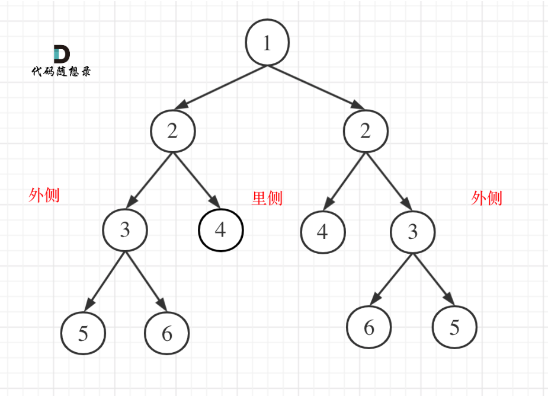

第六章  二叉树 part02


# 226.翻转二叉树 （优先掌握递归） 

这道题目 一些做过的同学 理解的也不够深入，建议大家先看我的视频讲解，无论做过没做过，都会有很大收获。

题目链接/文章讲解/视频讲解：https://programmercarl.com/0226.%E7%BF%BB%E8%BD%AC%E4%BA%8C%E5%8F%89%E6%A0%91.html 
## 递归
- 传参：节点
- 终止条件：节点为空则不操作
- 操作：左右子树交换
```Python
def invertTree(self, root: Optional[TreeNode]) -> Optional[TreeNode]:
    # 递归
    def invert(root):
        if not root:
            return 
        temp = root.left
        root.left = root.right
        root.right = temp
        invert(root.left)
        invert(root.right)
    
    invert(root)
    return root
```
## 迭代
- 类比层次遍历的迭代法
```Python
def invertTree(self, root: Optional[TreeNode]) -> Optional[TreeNode]:
    # 迭代

    if not root: return root

    que = deque()
    que.append(root)
    while que:
        for i in range(len(que)):
            cur = que.popleft()
            # 先入队子树
            if cur.left: que.append(cur.left)
            if cur.right: que.append(cur.right)
            # 再交换子树
            temp = cur.left
            cur.left = cur.right
            cur.right = temp
    return root
```

# 101. 对称二叉树 （优先掌握递归）  

先看视频讲解，会更容易一些。 

题目链接/文章讲解/视频讲解：https://programmercarl.com/0101.%E5%AF%B9%E7%A7%B0%E4%BA%8C%E5%8F%89%E6%A0%91.html  


- 左右节点相等
- 且左左==右右（外侧相等）、左右==右左（内侧相等）

## 递归
- 第一阶段：判断左右是否相同（考虑空空、一空一非空、非空且相等、非空且不等）
- 第二阶段：只有左右非空且相等时，再判断外侧是否等于外侧、内侧是否等于内侧
```Python
def isSymmetric(self, root: Optional[TreeNode]) -> bool:
    # 递归
    # 空树是对称的
    if not root: return True

    def is_symmetrical(left,right):
        # 第一阶段：判断左右子节点是否相同
        # 均非空
        if left and right: 
            if left.val == right.val: pass # 通过，进入第二阶段
            else: return False
        # 均为空，可以直接跳过第二阶段，判断为对称
        elif (not left) and (not right): 
            return True
        # 只有一侧为空
        elif left or right: 
            return False

        # 第二阶段：通过了第一阶段之后，判断孙节点的情况
        outside = is_symmetrical(left.left,right.right)
        inside = is_symmetrical(left.right,right.left)
        return outside and inside

    return is_symmetrical(root.left,root.right)
```
## 迭代
- 迭代。第一对左右子节点手动放入
- 比较左右，如果值相同则放入下轮需要比较的组合（左左和右右、左右和右左）,如果都为空则比较队列中的下一对，其他情况直接return False
- 注意：不需要for i in range(len(que)),因为和第几层无关，只需要保证每次入队的相邻两个节点是需要对比的就可以
```Python
def isSymmetric(self, root: Optional[TreeNode]) -> bool:
    
    if not root: return True

    que = deque()
    que.append(root.left)
    que.append(root.right)
    while que:
        left = que.popleft()
        right = que.popleft()
        # 均为空，跳过
        if not left and not right:
            continue
        # 值相等，入队要比较的节点对
        elif left and right and (left.val == right.val):
            que.append(left.left)
            que.append(right.right)
            
            que.append(left.right)
            que.append(right.left)
        # 不属于上面任何一种情况，则不对称
        else:
            return False
    return True
```

# 104.二叉树的最大深度 （优先掌握递归）

什么是深度，什么是高度，如何求深度，如何求高度，这里有关系到二叉树的遍历方式。

大家 要先看视频讲解，就知道以上我说的内容了，很多录友刷过这道题，但理解的还不够。

题目链接/文章讲解/视频讲解： https://programmercarl.com/0104.%E4%BA%8C%E5%8F%89%E6%A0%91%E7%9A%84%E6%9C%80%E5%A4%A7%E6%B7%B1%E5%BA%A6.html  

## 迭代
- 层次遍历，返回结果的层数
## 递归


# 111.二叉树的最小深度 （优先掌握递归）

先看视频讲解，和最大深度 看似差不多，其实 差距还挺大，有坑。

题目链接/文章讲解/视频讲解：https://programmercarl.com/0111.%E4%BA%8C%E5%8F%89%E6%A0%91%E7%9A%84%E6%9C%80%E5%B0%8F%E6%B7%B1%E5%BA%A6.html 

 ## 迭代
 - 见0721二叉树.md
 ## 递归