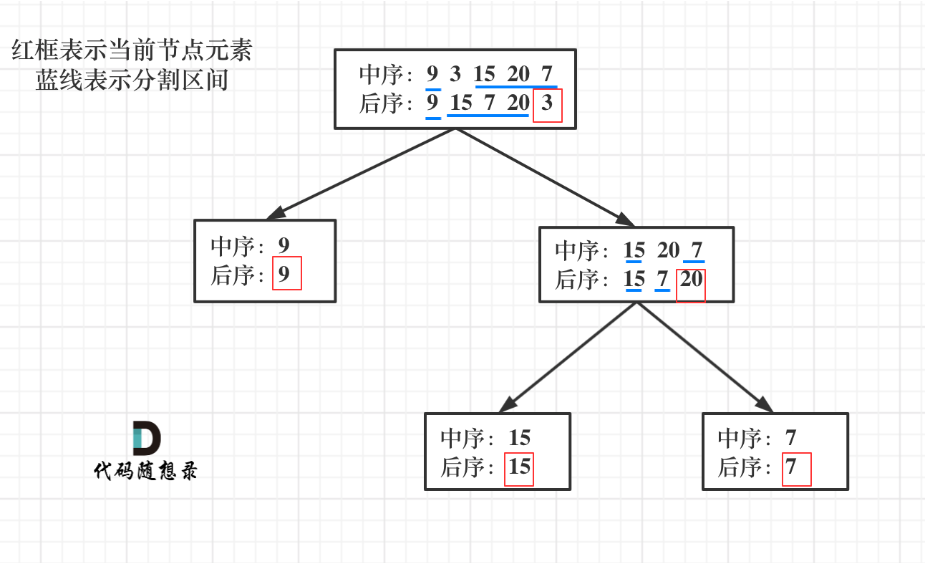
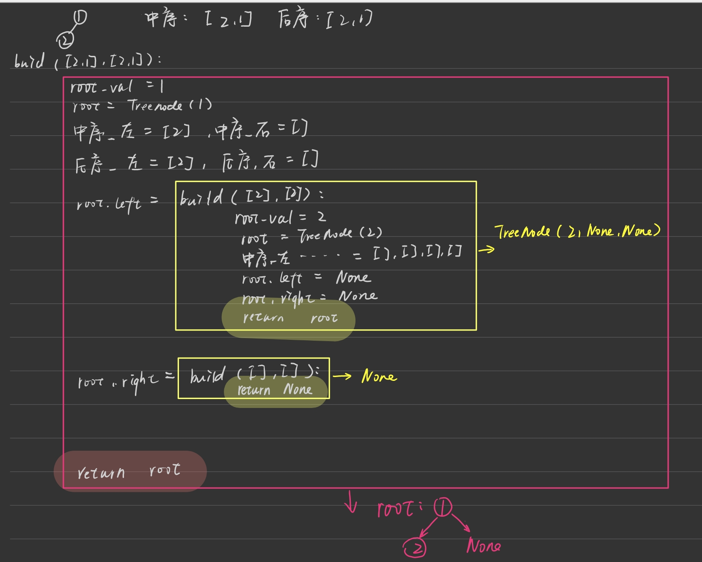

第六章 二叉树 part04


# 找树左下角的值  

本题递归偏难，反而迭代简单属于模板题， 两种方法掌握一下 

题目链接/文章讲解/视频讲解：https://programmercarl.com/0513.%E6%89%BE%E6%A0%91%E5%B7%A6%E4%B8%8B%E8%A7%92%E7%9A%84%E5%80%BC.html  

## 迭代
- 沿用层次遍历的迭代法，更新每一层的第一个元素即可
```Python
def findBottomLeftValue(self, root: Optional[TreeNode]) -> int:

    que = deque()
    que.append(root)
    result = root.val # 结果值
    while que:
        for i in range(len(que)):
            cur = que.popleft()
            if i == 0:
                result = cur.val
            if cur.left: que.append(cur.left)
            if cur.right: que.append(cur.right)
    return result
```

# 路径总和  

本题 又一次涉及到回溯的过程，而且回溯的过程隐藏的还挺深，建议先看视频来理解 


112. 路径总和，和 113. 路径总和ii 一起做了。 优先掌握递归法。

题目链接/文章讲解/视频讲解：https://programmercarl.com/0112.%E8%B7%AF%E5%BE%84%E6%80%BB%E5%92%8C.html  

## 递归（求所有路径模板的演变）
- 注意：求所有路径的递归模板的入参path字符串是不可变对象，每次新传参path+'->'是一个新的字符串对象；但是如果这里用可变对象path，那么右子树递归函数中的path会被上面左子树的一系列操作污染
- 每次新建一个```new_path = path + [node.val]```对象即可。（不能用append，append是原地修改且无返回）
```Python
# 112
def hasPathSum(self, root: Optional[TreeNode], targetSum: int) -> bool:
    # 递归
    if not root: return False

    def find_path(node,path):
        # 新建用于传参，防止右子树的入参path被污染
        new_path = path + [node.val]
        if not node.left and not node.right:
            if sum(new_path) == targetSum:
                result.append(new_path)
        if node.left: 
            find_path(node.left,new_path)
        if node.right:
            find_path(node.right,new_path)
    
    result = []
    find_path(root,[])
    # 如果在上面都没有return true，就是没找到
    return True if result else False
```
```Python
# 113
def pathSum(self, root: Optional[TreeNode], targetSum: int) -> List[List[int]]:
    # 递归（求所有子路径的演变,注意右子树入参path不能被前面的左子树操作污染，所以每一轮都新建newpath=path+[node.val]传到下一轮）

    if not root: return []
    
    def find_path(node,path):
        new_path = path + [node.val]
        # 是叶节点
        if not node.left and not node.right:
            if sum(new_path) == targetSum:
                result.append(new_path)

        if node.left:
            find_path(node.left,new_path)
        if node.right:
            find_path(node.right,new_path)
        
    result = []
    find_path(root,[])
    return result
```

## 迭代（层次遍历模板演变）
- 每次出队一个元组（节点，未加该节点的当前和），当前和加上节点值。如果是子节点，判断当前和是否等于目标；如果不是，有左入（左，当前和），有右入（右，当前和）。直到队空
```Python
# 112
def hasPathSum(self, root: Optional[TreeNode], targetSum: int) -> bool:

    if not root: return False

    que = deque()
    que.append((root,0))
    while que:
        cur,cursum = que.popleft()
        cursum += cur.val
        if not cur.left and not cur.right:
            if cursum == targetSum:
                return True
        if cur.left: que.append((cur.left,cursum))
        if cur.right: que.append((cur.right,cursum))
    return False
```

- 每次出队一个元组（节点，未加该节点的当前路径列表），当前路径列表加上节点值。如果是子节点，判断当前和是否等于目标；如果不是，有左入（左，新路径列表new_path），有右入（右，新路径列表）。直到队空
- 每一轮都新建一个新路径列表,不能用.append追加到原path，因为传参path的话，遇到叶子节点之后还会继续append
```Python
# 113
def pathSum(self, root: Optional[TreeNode], targetSum: int) -> List[List[int]]:
    # 迭代（层次遍历迭代的演变）

    if not root: return []

    result = [] # 收集结果
    que = deque()
    que.append((root,[]))
    while que:
        cur,path = que.popleft()
        new_path = path+[cur.val] # 新建，放入下一轮
        if not cur.left and not cur.right:
            if sum(new_path) == targetSum:
                result.append(new_path)
        if cur.left:
            que.append((cur.left,new_path))
        if cur.right:
            que.append((cur.right,new_path))
    return result
```

# 从中序与后序遍历序列构造二叉树 

本题算是比较难的二叉树题目了，大家先看视频来理解。 

106.从中序与后序遍历序列构造二叉树，105.从前序与中序遍历序列构造二叉树 一起做，思路一样的

注意：前中后序中，两两组合，只有**前序后序无法唯一确定一棵二叉树**

题目链接/文章讲解/视频讲解：https://programmercarl.com/0106.%E4%BB%8E%E4%B8%AD%E5%BA%8F%E4%B8%8E%E5%90%8E%E5%BA%8F%E9%81%8D%E5%8E%86%E5%BA%8F%E5%88%97%E6%9E%84%E9%80%A0%E4%BA%8C%E5%8F%89%E6%A0%91.html 

- 后序最后一个数为根节点，中序以这个根节点为分割点分成左子树和右子树
- 后序前面和中序左子树等长的部分是左子树，后面和中序右子树等长的部分是右子树
- 以此类推

- 106递归模拟


## 递归
```Python
# 106
def buildTree(self, inorder: List[int], postorder: List[int]) -> Optional[TreeNode]:
    # 递归
    # 序列为空说明要返回空节点
    if not inorder: return None

    # 要返回的节点root
    root_val = postorder[-1]
    root = TreeNode(root_val)

    # 获取下一轮的中序
    inorder_left = inorder[:inorder.index(root_val)]
    inorder_right = inorder[inorder.index(root_val)+1:]

    # 获取下一轮的后序
    postorder_left = postorder[:len(inorder_left)]
    postorder_right = postorder[:-1][len(inorder_left):] # 注意最后一个是本轮根节点，不要

    # 左右子树
    root.left = self.buildTree(inorder_left,postorder_left)
    root.right = self.buildTree(inorder_right,postorder_right)

    # 返回新建的节点
    return root
```
```Python
# 105类似106
```


