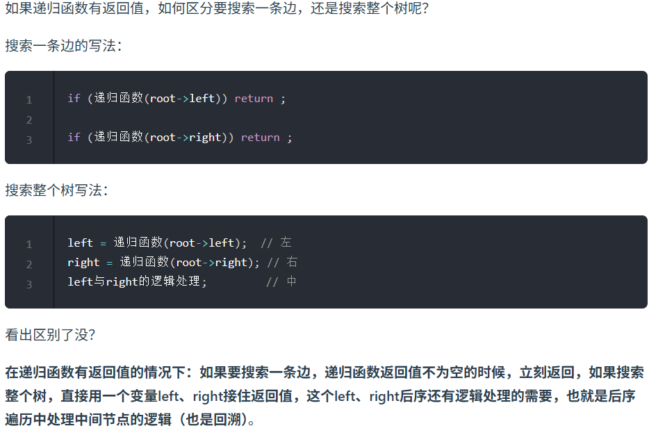
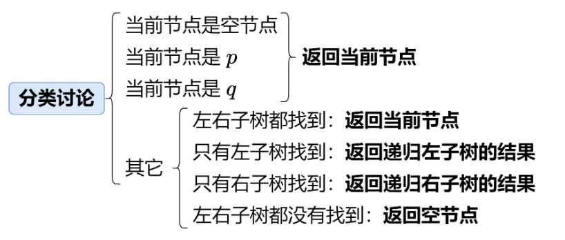

第六章 二叉树part06

 详细布置 

# 530.二叉搜索树的最小绝对差 

需要领悟一下二叉树遍历上双指针操作，优先掌握递归 
题目链接/文章讲解：https://programmercarl.com/0530.%E4%BA%8C%E5%8F%89%E6%90%9C%E7%B4%A2%E6%A0%91%E7%9A%84%E6%9C%80%E5%B0%8F%E7%BB%9D%E5%AF%B9%E5%B7%AE.html 
视频讲解：https://www.bilibili.com/video/BV1DD4y11779 

## 中序遍历转序列
- 中序遍历序列是递增序列，遍历序列记录最小差

```Python
def getMinimumDifference(self, root: Optional[TreeNode]) -> int:
    # 递归
    def traverse(node,nodelist):
        if not node: 
            return
        traverse(node.left,nodelist)
        nodelist.append(node.val)
        traverse(node.right,nodelist)
    
    nodelist = []
    result = float('inf')
    traverse(root,nodelist)
    for i in range(1,len(nodelist)):
        result = min(result,abs(nodelist[i]-nodelist[i-1]))
    return result
```

# 501.二叉搜索树中的众数 

和 530差不多双指针思路，不过 这里涉及到一个很巧妙的代码技巧。

可以先自己做做看，然后看我的视频讲解。

https://programmercarl.com/0501.%E4%BA%8C%E5%8F%89%E6%90%9C%E7%B4%A2%E6%A0%91%E4%B8%AD%E7%9A%84%E4%BC%97%E6%95%B0.html  
视频讲解：https://www.bilibili.com/video/BV1fD4y117gp  

## 递归获取非递减便利序列再处理

```Python
def findMode(self, root: Optional[TreeNode]) -> List[int]:
    def traverse(node,result):
        if not node: return
        traverse(node.left,result)
        result.append(node.val)
        traverse(node.right,result)
    
    result = []
    traverse(root,result)

    num_cnt = Counter(result)
    cnt_num = defaultdict(list)
    for num,cnt in num_cnt.items():
        cnt_num[cnt].append(num)
    max_cnt = max(cnt_num.keys())
    return cnt_num[max_cnt]
```
## 直接递归
- 中序便利保证是非递减顺序（相同的数集中出现）。函数外pre先指向空，依次在传参更新为下一个节点。函数外设置变量cnt计数、maxcnt记录历史最大，更大时更新。函数外设置result列表收集结果节点值，当cnt更大时清空，加入当前节点值
- 递归外使用的整型变量最好用类成员变量，防止函数内局部
```Python
class Solution:
    def __init__(self):
        self.cnt = 0
        self.result = []
        self.maxcnt = 0
        self.pre = None # 指向所有节点之前
    
    def find_mode(self,cur): # 成员函数参数要有self
        if not cur:
            return
        # 左
        self.find_mode(cur.left)
        # 根(处理)
        if not self.pre: # 第一轮
            self.cnt = 1
        elif self.pre.val == cur.val: # 相同节点
            self.cnt += 1
        elif self.pre.val != cur.val:
            self.cnt = 1 #不同节点值，重置频率为1
        
        if self.cnt > self.maxcnt: # 比历史频率大
            self.maxcnt = self.cnt
            self.result.clear() # 清空历史结果
            self.result.append(cur.val)
        elif self.cnt == self.maxcnt:
            self.result.append(cur.val) # 和历史频率一样

        self.pre = cur # 移动
        self.find_mode(cur.right)
        return
    
    def findMode(self, root: Optional[TreeNode]) -> List[int]:
        # 直接递归
    
        self.find_mode(root)
        return self.result
```

# 236. 二叉树的最近公共祖先 

本题其实是比较难的，可以先看我的视频讲解 

https://programmercarl.com/0236.%E4%BA%8C%E5%8F%89%E6%A0%91%E7%9A%84%E6%9C%80%E8%BF%91%E5%85%AC%E5%85%B1%E7%A5%96%E5%85%88.html 
视频讲解：https://www.bilibili.com/video/BV1jd4y1B7E2   



思路
- 终止情况：空节点
- 单层逻辑：左右中后序（从下到上）遍历。如果当前节点是p或者q返回当前节点，在单层操作里，如果当前节点的左右子树都找到了说明当前节点是最近的公共节点；如果只有一侧子树找到说明都在这一侧（题目说pq肯定存在），返回这一侧结果即可


```Python
def lowestCommonAncestor(self, root: 'TreeNode', p: 'TreeNode', q: 'TreeNode') -> 'TreeNode':
    # 递归
    

    def find_ancestor(cur,p,q):
        # 终止条件
        if not cur: return None
        if cur == p or cur == q:
            return cur
        # 遍历整棵树，需要设置承接返回值的变量
        # 左、右
        find_left = find_ancestor(cur.left,p,q)
        find_right = find_ancestor(cur.right,p,q)
        # 中
        if not find_left: return find_right # 如果左子树没有，返回右子树的节点
        if not find_right: return find_left # 
        if find_left and find_right:
            return cur
    
    return find_ancestor(root,p,q)
```
