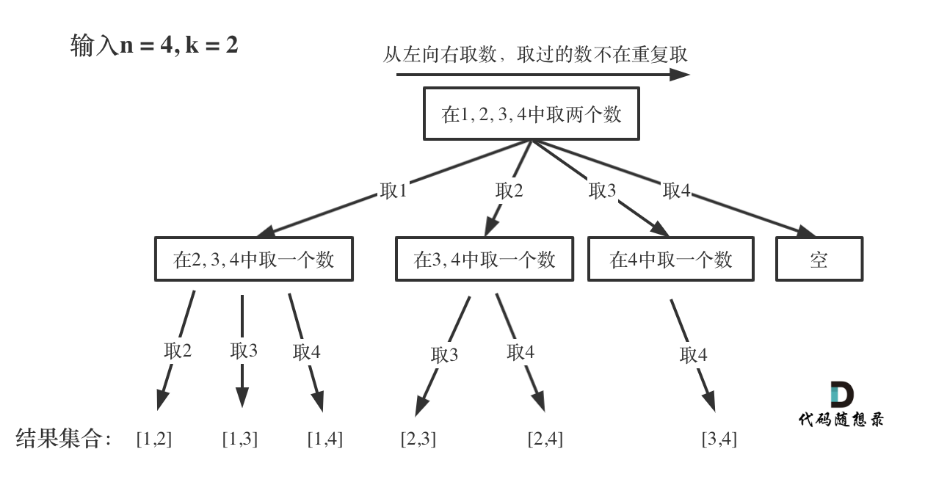

第七章 回溯算法part01 

 理论基础 

其实在讲解二叉树的时候，就给大家介绍过回溯，这次正式开启回溯算法，大家可以先看视频，对回溯算法有一个整体的了解。

题目链接/文章讲解：https://programmercarl.com/%E5%9B%9E%E6%BA%AF%E7%AE%97%E6%B3%95%E7%90%86%E8%AE%BA%E5%9F%BA%E7%A1%80.html  
视频讲解：https://www.bilibili.com/video/BV1cy4y167mM  

# 77. 组合  

对着 在 回溯算法理论基础 给出的 代码模板，来做本题组合问题，大家就会发现 写回溯算法套路。

在回溯算法解决实际问题的过程中，大家会有各种疑问，先看视频介绍，基本可以解决大家的疑惑。

本题关于剪枝操作是大家要理解的重点，因为后面很多回溯算法解决的题目，都是这个剪枝套路。 

题目链接/文章讲解：https://programmercarl.com/0077.%E7%BB%84%E5%90%88.html   
视频讲解：https://www.bilibili.com/video/BV1ti4y1L7cv 
剪枝操作：https://www.bilibili.com/video/BV1wi4y157er   

- 抽象思维：把完整的代码过程模拟下来，顺时针旋转90度，就是树结构。

- 额外剪枝版本：```for i in range(startIndex, n-(k-len(path) +2))```n个数，遍历到接近n时，如果后面满足不了长度要求的就舍弃这些遍历轮次。通过计算最后一轮满足所需长度（k-len(path))要求所在位置+1来确定终止位置。比如还缺2个，那么当i到8的时候，后面能添加8和9两个数进来，所以i遍历到8即可终止，i不需要遍历到9
- result.append(path[:]) 需要用切片是因为切片是一个副本，如果直接用path，result里面的每一个path都会因为外面的path改动而变动。
```Python
class Solution:
    def combine(self, n: int, k: int) -> List[List[int]]:
        result = []  # 存放结果集
        path = [] # 存放结果本身
        self.backtracking(n, k, 1, path, result) # 区间从1开始
        return result
    
    def backtracking(self, n, k, startIndex, path, result):
        # 如果path满足要求后会return跳到上一层循环，要pop掉最后一个接受上一层循环的下一轮的数字
        
        if len(path) == k:
            result.append(path[:]) 
            return
        for i in range(startIndex, n + 1):  # 区间要包括n
            path.append(i)  # 处理节点
            self.backtracking(n, k, i + 1, path, result)
            path.pop()  # 回溯，撤销处理的节点
```

# 216.组合总和III 

如果把 组合问题理解了，本题就容易一些了。 

题目链接/文章讲解：https://programmercarl.com/0216.%E7%BB%84%E5%90%88%E6%80%BB%E5%92%8CIII.html   
视频讲解：https://www.bilibili.com/video/BV1wg411873x

- 剪枝1：改为遍历终止在最后一个满足长度要求的i,

    ```for i in range(index,9-(k-len(path)+1+1))```

- 剪枝2：当前和大于目标和，返回上一层
```Python
class Solution:
    def combinationSum3(self, k: int, n: int) -> List[List[int]]:
        path = []
        result = []
        cursum = 0
        self.backtrack(n,k,1,cursum,path,result)
        return result

    def backtrack(self,n,k,index,cursum,path,result):
        # 如果和超过n，直接返回上一层
        if cursum > n:
            return
        # 如果长度达到k需要返回上一层，停止添加数字进入当前的path
        if len(path) == k:
            if cursum == n:
                result.append(path[:]) # 创建切片副本放入，以防result里的path随外面操作变更
            return
        for i in range(index,10):
            path.append(i)
            cursum += i
            self.backtrack(n,k,i+1,cursum,path,result)
            # 回退上一层
            path.pop()
            cursum -= i
```

# 17.电话号码的字母组合 

本题大家刚开始做会有点难度，先自己思考20min，没思路就直接看题解。 

题目链接/文章讲解：https://programmercarl.com/0017.%E7%94%B5%E8%AF%9D%E5%8F%B7%E7%A0%81%E7%9A%84%E5%AD%97%E6%AF%8D%E7%BB%84%E5%90%88.html   
视频讲解：https://www.bilibili.com/video/BV1yV4y1V7Ug

- index记录**层数、字母组合长度、digits遍历的数字位置**
- 当index等于数字长度时，字母组合满足要求，添加进结果集
- 递归调用直接传递index+1
- result里面的s不受到外面s更改而影响，因为**s是不可变对象，append进去的是s的副本，不需要切片**
```Python
def letterCombinations(self, digits: str) -> List[str]:
        
        def backtrack(index,result,s,n):
            if index == n:
                result.append(s) 
                return
            num = digits[index] # 号码
            letters = mapping[int(num)] # 号码对应字母
            for i in letters:
                s = s + i
                backtrack(index+1,result,s,n)
                s = s[:-1]
        
        if not digits: return []

        n = len(digits)
        index = 0
        mapping=["","","abc","def",'ghi','jkl','mno','pqrs','tuv','wxyz']
        result = []
        s = ''
        backtrack(index,result,s,n)
        return result
```

