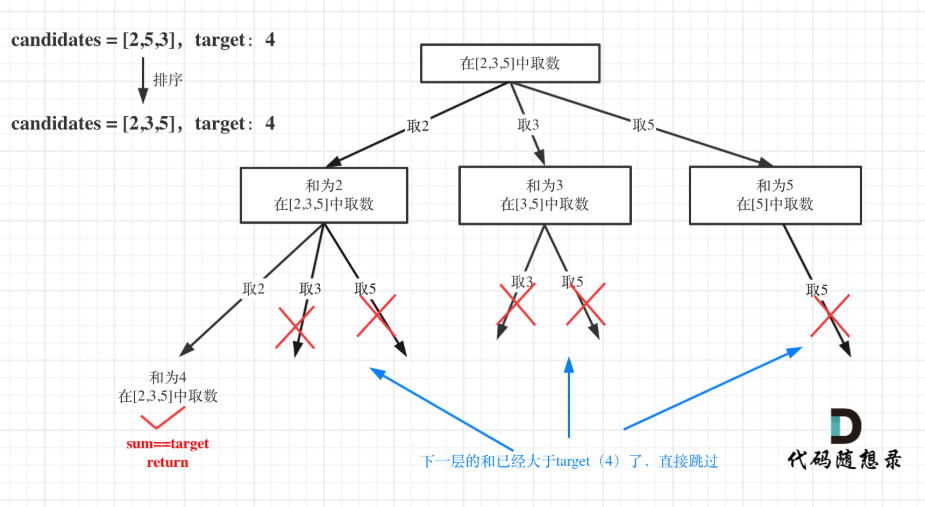

第七章 回溯算法part02


# 39. 组合总和 

本题是 集合里元素可以用无数次，那么和组合问题的差别 其实仅在于 startIndex上的控制

题目链接/文章讲解：https://programmercarl.com/0039.%E7%BB%84%E5%90%88%E6%80%BB%E5%92%8C.html 
视频讲解：https://www.bilibili.com/video/BV1KT4y1M7HJ  



- 可以重复，说明递归的时候传入的备选还是**当前以及之后的candidates**，而不是之后的candidate，所以传参i而不是i+1
- 终止条件：和大于目标值
- 操作：等于目标值，添加到结果集
- 循环：当前和加上当前元素，路径加上当前元素，下一个循环，当前和、路径回退
- 注意：本题需要去重，先对candidates排序可以解决重复问题

```Python
def combinationSum(self, candidates: List[int], target: int) -> List[List[int]]:
        # 递归回溯
        
        def backtrack(candidates,cursum,path,result,index):
            if cursum > target:
                return
            if cursum == target:
                result.append(path[:])
                return 
            for i in range(index,len(candidates)):
                cursum += candidates[i]
                path.append(candidates[i])
                backtrack(candidates,cursum,path,result,i)
                path.pop()
                cursum -= candidates[i]
        
        path = []
        result = []
        cursum = 0
        index = 0
        candidates = sorted(candidates)
        backtrack(candidates,cursum,path,result,index)
        return result
```

# 40.组合总和II 

本题开始涉及到一个问题了：去重。

注意题目中给我们 集合是有重复元素的，那么求出来的 组合有可能重复，但题目要求不能有重复组合。 

题目链接/文章讲解：https://programmercarl.com/0040.%E7%BB%84%E5%90%88%E6%80%BB%E5%92%8CII.html   
视频讲解：https://www.bilibili.com/video/BV12V4y1V73A
- 和39.一样，组合中元素个数是个变量，不能确定循环的次数，不能用kmp只能回溯
- 和39.的区别是，结果每个组合**不能重复取同一个位置的数**
- 同一个循环里如果i对应的数和上一轮i对应数相等，说明同层里当前开启的i这一轮即将和前一轮的子节点一模一样（因为前一轮定位元素也是这个数，子节点的生长逻辑是**把这个数拿出来，再从剩下的candidates里面选**），所以除了第一轮的其他都要跳过，实现去重
- 注意输出要排序，所以先把candidates排序
```Python
def combinationSum2(self, candidates: List[int], target: int) -> List[List[int]]:
    # 递归回溯
    def backtrack(candidates,index,cursum,path,result):
        if cursum > target:
            return
        if cursum == target:
            result.append(path[:])
            return
        for i in range(index,len(candidates)):
            # 同层跳过相邻元素重复的后者
            if i > index and candidates[i-1] ==candidates[i]:
                continue
            path.append(candidates[i])
            cursum += candidates[i]
            backtrack(candidates,i+1,cursum,path,result)
            cursum -= candidates[i]
            path.pop()
    
    index = 0
    cursum = 0
    path =[]
    result = []
    candidates = sorted(candidates)
    backtrack(candidates,index,cursum,path,result)
    return result
```
# 131.分割回文串  

本题较难，大家先看视频来理解 分割问题，明天还会有一道分割问题，先打打基础。 

https://programmercarl.com/0131.%E5%88%86%E5%89%B2%E5%9B%9E%E6%96%87%E4%B8%B2.html  
视频讲解：https://www.bilibili.com/video/BV1c54y1e7k6  
- 第一层：树的第一层只切割一次，包括第一个元素后切一刀、···、全体元素后切一刀。如果本层切割的左侧是回文串，path收集切割的左侧字符串，才开启第二层。
- 第二层：取第一层**切割后的右侧剩余字符**串来切割，只切一次，切法同第一层。如果本层切割的左侧还是回文串，path收集切割的左侧字符串，才开启第三层。
- 直到右侧剩余字符串的起始位置index==len(s)，说明树长到了没办法再切割的深度，每一层都通过了是回文串的判断，此时可以把path添加到结果集中
- 注意：i的起始是start_index是一个定量，不一定是0，所以切片的时候应该是s[start_index:i+1]而不是s[start_index:start_index+i]
```Python
def partition(self, s: str) -> List[List[str]]:
    # 思路：只有切割的左侧是回文串，才对右侧字符串切割，循环往复
    def backtrack(start_index,path,result):
        # 定位i走到了尽头，说明两个含义，一是第一层已经达到了最大宽度，二是递归导致的所有切片都通过了回文检验可以收集path了
        if start_index == len(s):
            result.append(path[:])
            return
        for i in range(start_index,len(s)): 
            # 该层切割左侧（上一层切割后的右侧，被本层切割后的左侧）判断
            if s[start_index:i+1] == s[start_index:i+1][::-1]:
                path.append(s[start_index:i+1])
                backtrack(i+1,path,result)
                path.pop()
    
    start_index = 0
    path = []
    result = []
    backtrack(start_index,path,result)
    return result
```
