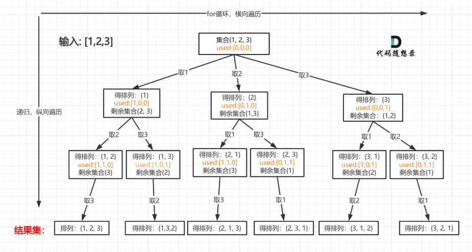
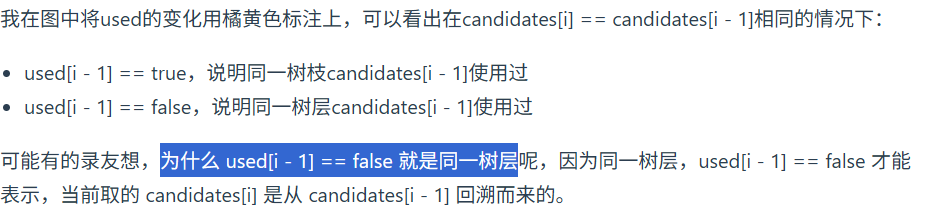

第七章 回溯算法 part04

 
# 491.递增子序列 

本题和大家刚做过的 90.子集II 非常像，但又很不一样，很容易掉坑里。 

https://programmercarl.com/0491.%E9%80%92%E5%A2%9E%E5%AD%90%E5%BA%8F%E5%88%97.html 

视频讲解：https://www.bilibili.com/video/BV1EG4y1h78v  

- 子序列，说明不能先对nums排序。
- 思路类似子集，当**path有大于1个元素后开始每个节点都收集**。判断当前元素是非递减才再开启下一轮
- 去重逻辑：同一个子序列里，**一个原位置的数只能用一次，原位置不同的相同数字可以同时出现在一个子序列里**。
- 去重实现：每一层（即每一个循环）开启前，放一个空数组，在循环里存放该层已使用的数字。如果当前i对应的数字在这个数组里，说明这个节点的下面节点和同层某个节点的右下节点们重复，就跳过这个节点；如果这个节点非递减才开启下一层

```Python
def findSubsequences(self, nums: List[int]) -> List[List[int]]:
    
    def backtrack(nums,index,path,result):
        level_used = set()
        for i in range(index,len(nums)):
            # 非递减才添加进入path
            if (path and path[-1] > nums[i]):
                continue
            # 同层去重（nums不是有序所以用不了相邻相同的条件去去重，而用level_used记录使用过的）
            if (nums[i] in level_used):
                continue
            path.append(nums[i])
            level_used.add(nums[i])
            if len(path) > 1:
                result.append(path[:]) # 每添加一个元素到path都收集一次path
            backtrack(nums,i+1,path,result)
            path.pop()
    path = []
    result = []
    index = 0
    backtrack(nums,index,path,result)
    return result
```

# 46.全排列 
本题重点感受一下，排列问题 与 组合问题，组合总和，子集问题的区别。 为什么排列问题不用 startIndex 
https://programmercarl.com/0046.%E5%85%A8%E6%8E%92%E5%88%97.html   
视频讲解：https://www.bilibili.com/video/BV19v4y1S79W   


- nums不重复,所以可以通过当前节点是否在path中，决定是否跳过同层的这一轮
- 每开启新一层都用原来的nums，因为是排列所以起始位置都是0（组合用i+1）

```Python
def permute(self, nums: List[int]) -> List[List[int]]:
    
    def backtrack(nums,path,result):
        # 终止条件
        if len(path) == len(nums):
            result.append(path[:])

        for i in range(len(nums)):
            # 跳过path里出现过的数字
            if nums[i] in path:
                continue
            path.append(nums[i])
            backtrack(nums,path,result)
            path.pop()
    
    path = []
    result = []
    backtrack(nums,path,result)
    return result
```

# 47.全排列 II 
本题 就是我们讲过的 40.组合总和II 去重逻辑 和 46.全排列 的结合，可以先自己做一下，然后重点看一下 文章中 我讲的拓展内容： used[i - 1] == true 也行，used[i - 1] == false 也行 

https://programmercarl.com/0047.%E5%85%A8%E6%8E%92%E5%88%97II.html     
 
视频讲解：https://www.bilibili.com/video/BV1R84y1i7Tm

- 如何判断是同一树层中的重复：确定当前节点是前一个节点（同一循环的的上一轮）结束后，used回退为False之后，回溯而来开启的
- **为什么排列问题同层判断需要添加```used[i-1] ==Fasle```**: 因为组合问题那样每一层从index+1开始，组合问题可以通过i>index就知道是同层的i节点。而排列问题的每一层都从0位置开始，光凭下标i>0不能断定是同一层的非首位节点，只能保证每层第一个节点顺利进行

- 和[46.全排列](#46全排列)的区别：nums含有重复元素。所以不可以通过是否在path中已存在来判断是否开启当前节点（path已存在的元素下标和当前元素下标不同时，还是可以开当前节点的），需要用和下标、path强绑定的used数组记录,used数组是和path同步的替身
- 对结果之间去重的，不规定要按原顺序的，都先对nums排序
- 去重思路：类似[90.子集II](./0801回溯.md) 。同层，如果当前i节点和前一个i-1节点的数字相同，则跳过这个节点(层内第一个节点不跳过)进入同层下一个节点。因为当前节点开启的下面层将会和前一个节点的下面层一模一样。
- 排列：不是组合，每一轮都从下标0开始
```Python
def permuteUnique(self, nums: List[int]) -> List[List[int]]:
        
        def backtrack(nums,path,used,result):
            # 终止条件
            if len(path) == len(nums):
                result.append(path[:])
                return
                
            for i in range(len(nums)):
                # 同层去重剪枝.
                if i > 0 and nums[i] == nums[i-1] and (used[i-1] == False):
                    continue
                # 排列剪枝
                if used[i] == True: # 当前下标元素在当前path中被使用过就跳过,用used[i] == True代替不含重复元素题目中的nums[i] in path
                    continue
                path.append(nums[i])
                used[i] = True
                backtrack(nums,path,used,result)
                path.pop()
                used[i] = False
        path = []
        result = []
        used = [False]*len(nums)
        nums = sorted(nums)
        backtrack(nums,path,used,result)
        return result
```

下面这三道题都非常难，建议大家一刷的时候 可以适当选择跳过。 

因为 一刷 也不求大家能把这么难的问题解决，大家目前能了解一下题目的要求，了解一下解题思路，不求能直接写出代码，先大概熟悉一下这些题，二刷的时候，随着对回溯算法的深入理解，再去解决如下三题。 


# 332.重新安排行程（可跳过） 
 
本题很难，一刷的录友刷起来 比较费力，可以留给二刷的时候再去解决。
本题没有录制视频，当初录视频是按照 《代码随想录》出版的目录来的，当时没有这道题所以就没有录制。
https://programmercarl.com/0332.%E9%87%8D%E6%96%B0%E5%AE%89%E6%8E%92%E8%A1%8C%E7%A8%8B.html  

# 51.N皇后(适当跳过)
这道题目还是很经典的，一刷的录友们建议看看视频了解了解大体思路 就可以 （如果没时间本次就直接跳过） ，先有个印象，二刷的时候重点解决。  

https://programmercarl.com/0051.N%E7%9A%87%E5%90%8E.html   
视频讲解：https://www.bilibili.com/video/BV1Rd4y1c7Bq 

# 37.解数独（适当跳过）
 同样，一刷的录友们建议看看视频了解了解大体思路（如果没时间本次就直接跳过），先有个印象，二刷的时候重点解决。 
。
https://programmercarl.com/0037.%E8%A7%A3%E6%95%B0%E7%8B%AC.html   
视频讲解：https://www.bilibili.com/video/BV1TW4y1471V

总结  
刷了这么多回溯算法的题目，可以做一做总结了！
https://programmercarl.com/%E5%9B%9E%E6%BA%AF%E6%80%BB%E7%BB%93.html 


