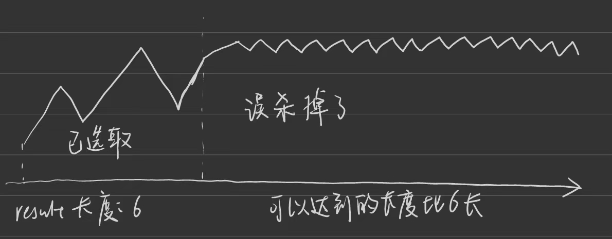

第八章 贪心算法 part01


贪心算法其实就是没有什么规律可言，所以大家了解贪心算法 就了解它没有规律的本质就够了。 

不用花心思去研究其规律， 没有思路就立刻看题解。

基本贪心的题目 有两个极端，要不就是特简单，要不就是死活想不出来。  

学完贪心之后再去看动态规划，就会了解贪心和动规的区别。

详细布置 

理论基础 

https://programmercarl.com/%E8%B4%AA%E5%BF%83%E7%AE%97%E6%B3%95%E7%90%86%E8%AE%BA%E5%9F%BA%E7%A1%80.html  

# 455.分发饼干  

https://programmercarl.com/0455.%E5%88%86%E5%8F%91%E9%A5%BC%E5%B9%B2.html  
- 排序，小饼干喂小胃口，不够就后移一块直到饼干用完
- result是满足的孩子个数也是孩子序列的下标
```Python
def findContentChildren(self, g: List[int], s: List[int]) -> int:
        
        g = sorted(g)  # 孩子
        s = sorted(s) # 饼干
        result = 0
        for j in range(len(s)):
            if result == len(g): # 当孩子都被满足时终止
                break
            if s[j] >= g[result]:
                result += 1
            
        return result
```

# 376. 摆动序列  

https://programmercarl.com/0376.%E6%91%86%E5%8A%A8%E5%BA%8F%E5%88%97.html  

- 注意：如果curdiff = nums[i]-result[i-1]的思路是错的,因为连续上坡或者下坡中就近选择了节点进入result，且后续所有元素都是和它相比


- 遍历到i时，后一个数和i的差要符合前一个差的要求，才考虑把i+1对应的数算入结果中。这样保证了连续上坡和下坡中找的是峰/谷
- 不用result列表，直接计数
```Python
def wiggleMaxLength(self, nums: List[int]) -> int:
        
        if len(nums) <= 1:
            return len(nums)  # 如果数组长度为0或1，则返回数组长度

        preDiff,curDiff ,result  = 0,0,1  #题目里nums长度大于等于1，当长度为1时，其实到不了for循环里去，所以不用考虑nums长度

        for i in range(len(nums) - 1):
            curDiff = nums[i + 1] - nums[i]
            if curDiff * preDiff <= 0 and curDiff !=0:  #差值为0时，不算摆动
                result += 1
                preDiff = curDiff  #如果当前差值和上一个差值为一正一负时，才需要用当前差值替代上一个差值
        return result
```
# 53. 最大子序和  

https://programmercarl.com/0053.%E6%9C%80%E5%A4%A7%E5%AD%90%E5%BA%8F%E5%92%8C.html  
- 暴力超时
- 连续子数组，可以通过止损进行更新和
- 一旦当前和成为负数，只会削弱后面的数。所以求和起始位置从下一个数开始(也就是求和清零)
 

```Python
def maxSubArray(self, nums: List[int]) -> int:
    
    result = float('-inf')
    cursum= 0
    for i in range(len(nums)):
        cursum += nums[i]
        result = max(result,cursum) # 记录历史最大
        if cursum < 0: # 清零
            cursum = 0
    return result
```


