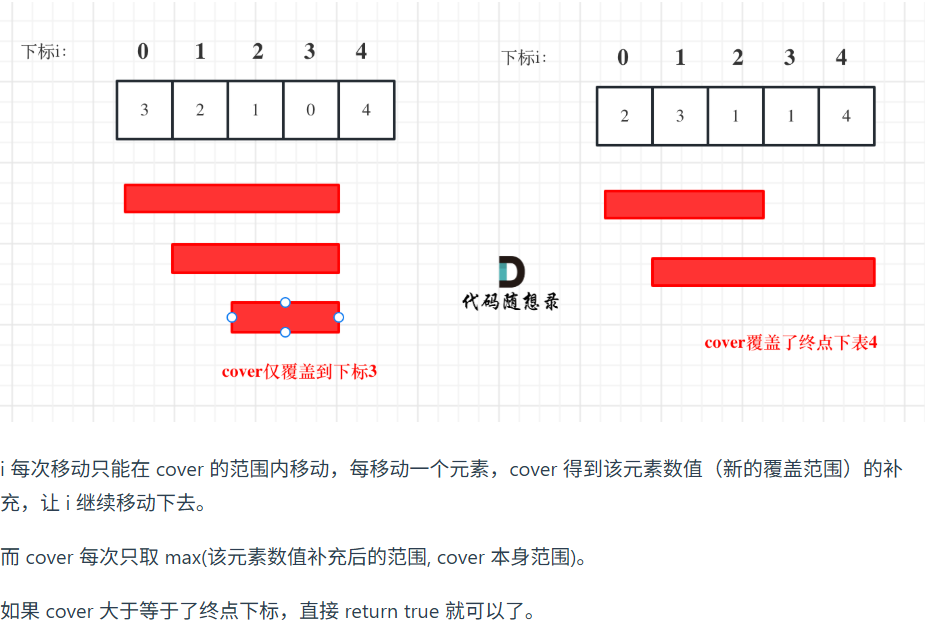

第八章 贪心算法 part02
# 122.买卖股票的最佳时机II  

本题解法很巧妙，本题大家可以先自己思考一下然后再看题解，会有惊喜！ 

https://programmercarl.com/0122.%E4%B9%B0%E5%8D%96%E8%82%A1%E7%A5%A8%E7%9A%84%E6%9C%80%E4%BD%B3%E6%97%B6%E6%9C%BAII.html  
- 贪心。收集所有的相邻两天之间的正收益就是能达到的最大收益，因为持有一段时间等价于在这段时间内第一天买入随后第二天卖出并买入直到最后一天卖出
- 直觉逻辑：如果知道一段时间的股价走势，会赚取**每一段谷-峰的差价**，等价于**收集所有日正差价**

```Python
def maxProfit(self, prices: List[int]) -> int:
    
    if len(prices) <= 1: return 0
    result = 0
    for i in range(1,len(prices)):
        daydiff = prices[i] - prices[i-1]
        if daydiff > 0:
            result += daydiff
    return result
```
# 55. 跳跃游戏 

本题如果没接触过，很难想到，所以不要自己憋时间太久，读题思考一会，没思路立刻看题解 

https://programmercarl.com/0055.%E8%B7%B3%E8%B7%83%E6%B8%B8%E6%88%8F.html 
- 在覆盖范围内，可以选择一步一步跳也可以一步到位，因为“贪心”，所以选择一步一步跳去检验所有的可能性，而不是一步到位地丧失中间越过的那些可能性。
- 遍历下标更新目前能到达的最远下标（覆盖范围内，永远有跳法组合可以到达），如果最远下标大于等于最后一个下标，说明能走到。如图右边，第一个格子覆盖范围是下标2，走到第二个格子时覆盖范围下标更新为1+3=4，如果想走到2就跳一步、想走到3就跳两步、想走到4就跳三步。
- 注意：遍历下标并不是跳的实际过程，而是为了把一定能跳到的范围圈出来。遍历的下标要在cover范围内且要在数组下标范围内（因为cover有可能超越数组）
- 语法：如果要在循环中不断修改循环中i的范围，用while不用for（回溯除外），因为range()一旦确定了就确定了，里面的对象怎么变不会影响一开始定下的轮数。

```Python
def canJump(self, nums: List[int]) -> bool:
    cover = 0 # 遍历过程中更新的最远覆盖下标
    i = 0 # 起始下标 
    while i <= cover and i <= len(nums)-1:
        new_cover = nums[i] + i
        cover = max(cover,new_cover)
        i += 1
    return cover >= len(nums)-1
```

# 45.跳跃游戏II 

本题同样不容易想出来。贪心就是这样，有的时候 会感觉简单到离谱，有时候，难的不行，主要是不容易想到。

https://programmercarl.com/0045.%E8%B7%B3%E8%B7%83%E6%B8%B8%E6%88%8FII.html    
- 第一个位置对应的覆盖范围内，最少只需要1步都能到达；
- 在第一个位置对应的覆盖范围内步进更新覆盖范围，在这个新范围内，从下标零到这个最新范围最少只需要2步能到达
- 记录首个覆盖范围，当i来逐步来到覆盖范围最后一个位置并更新范围后，步数加一、记录这个最新的覆盖范围作为下一个要更新的节点。
```Python
def jump(self, nums: List[int]) -> int:
    
    if len(nums) == 1: return 0

    last_cover,cur_cover = 0,0 # 两个范围初始化。目前步数为0，第一步的覆盖范围是下标0
    result = 0
    for i in range(len(nums)):
        # 更新最新覆盖范围
        cur_cover = max(cur_cover,nums[i]+i)
        # 如果到达前一个覆盖范围的最后一个元素
        if i == last_cover:
            # 走到覆盖范围的最后一个步数才加一，因为这个范围内只需要一步都能走到
            result += 1
            last_cover = cur_cover
            # 如果最新范围能够到达最后一个下标，则返回当前步数
            if cur_cover >= len(nums)-1:
                return result
```
# 1005.K次取反后最大化的数组和  
本题简单一些，估计大家不用想着贪心 ，用自己直觉也会有思路。 
https://programmercarl.com/1005.K%E6%AC%A1%E5%8F%96%E5%8F%8D%E5%90%8E%E6%9C%80%E5%A4%A7%E5%8C%96%E7%9A%84%E6%95%B0%E7%BB%84%E5%92%8C.html  
- 尽可能把最小的负数反转
- nums排序，从头到尾把负数先反转得到的就是最大和的数组。如果所有负数翻转后还有次数，是偶数则相当于随便找数反转两次保持最大和，是奇数则相当于必须在这个最大和数组中反转一个正数（选最小的正数，损失最小）
```Python
def largestSumAfterKNegations(self, nums: List[int], k: int) -> int:
   
    nums = sorted(nums)
    for i in range(len(nums)):
        if nums[i] < 0 and k > 0:
            nums[i] = -nums[i]
            k -= 1
    if k%2 == 1:
        nums[nums.index(min(nums))] = -min(nums)
    return sum(nums)
```


