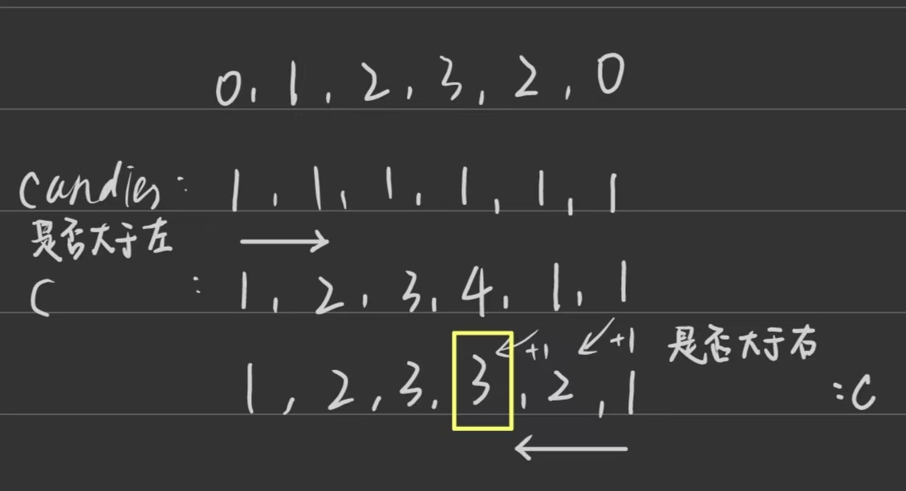
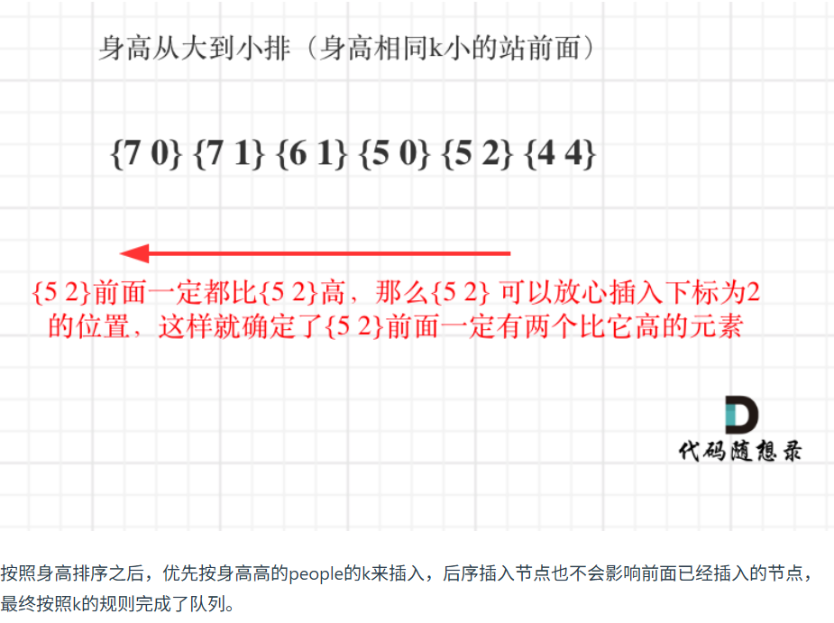

第八章 贪心算法 part03


# 134. 加油站 
本题有点难度，不太好想，推荐大家熟悉一下方法二 
https://programmercarl.com/0134.%E5%8A%A0%E6%B2%B9%E7%AB%99.html  
- 环绕一圈，数组不需要改为环形链表
- 从0开始选择加油站，分别记录当前加油站到下一个加油站的剩余油量、总剩余油量。**当当前剩余油量出现负数说明无法环绕，选择下一个加油站作为起点**，重新记录当前剩余油量
- 为什么选择当前油量出现负数时的下一个加油站作为新起点：因为从出发到现在，如何一个加油站作为起点，都到不了下一个加油站，反证法证明
```PYthon
def canCompleteCircuit(self, gas: List[int], cost: List[int]) -> int:
    # 总油量-总耗费<0，不能环绕，可以在一次循环里同时记录
    # 当前油量出现负数，选择下一个加油站作为起点
    result = 0
    cur_gas,total_gas = 0,0
    for i in range(len(gas)):
        # 到下一个加油站后的剩余油量
        cur_gas += gas[i] - cost[i]
        # 一圈总计剩余油量
        total_gas += gas[i] - cost[i]
        if cur_gas < 0:
            cur_gas = 0 # 当前剩余油量为零，下一个i加油站为起点
            result = i+1
    return -1 if total_gas<0 else result
```

# 135. 分发糖果 
本题涉及到一个思想，就是想处理好一边再处理另一边，不要两边想着一起兼顾，后面还会有题目用到这个思路 
https://programmercarl.com/0135.%E5%88%86%E5%8F%91%E7%B3%96%E6%9E%9C.html 
- 相邻都需要比较，可以先根据左边情况给每个孩子分糖果，分完之后再倒过来从后遍历，根据右边情况给孩子分糖果
- 第一遍从前往后遍历，确保每个孩子和其左侧符合要求；第二遍需要从后往前遍历，否则会出现更新赋值后不满足第一遍遍历中的要求 
- 第二遍从后往前遍历，根据右侧孩子情况给当前孩子分糖果**右边孩子糖果+1与当前孩子（满足第一遍要求）分得糖果的较高值**，如果仅用右侧孩子+1的方法会和第一遍的要求冲突

```Python
def candy(self, ratings: List[int]) -> int:
    
    candies = [1]*len(ratings) # 先每人分一颗糖果
    # 从左往右，根据左边孩子评分给当前孩子分糖果
    for i in range(1,len(ratings)):
        if ratings[i] > ratings[i-1]:
            candies[i] = candies[i-1] + 1
    # 从右往左，根据右边孩子给当前孩子分
    for i in range(-2,-len(ratings)-1,-1):
        if ratings[i] > ratings[i+1]:
            candies[i] = max(candies[i],candies[i+1]+1)
    return sum(candies)
```
# 860.柠檬水找零 

本题看上好像挺难，其实很简单，大家先尝试自己做一做。
https://programmercarl.com/0860.%E6%9F%A0%E6%AA%AC%E6%B0%B4%E6%89%BE%E9%9B%B6.html  
- 直觉：优先消耗大面值钞票去找零，因为小面值能为更多的情况找零，尽可能保留小面值
- 分类讨论，建立钱包
```Python
def lemonadeChange(self, bills: List[int]) -> bool:
    
    checks = {5:0,10:0}
    for i in bills:
        if i == 5:
            checks[5] += 1
        if i == 10:
            checks[10] += 1
            if checks[5] > 0:
                checks[5] -= 1
            else: return False
        if i == 20:
            # checks[20] += 1
            if checks[10] > 0 and checks[5] > 0:
                checks[10] -= 1
                checks[5] -= 1
            elif checks[10] == 0 and checks[5] >= 3:
                checks[5] -= 3
            else: return False
    return True
```

# 406.根据身高重建队列 

本题有点难度，和分发糖果类似，不要两头兼顾，处理好一边再处理另一边。 
https://programmercarl.com/0406.%E6%A0%B9%E6%8D%AE%E8%BA%AB%E9%AB%98%E9%87%8D%E5%BB%BA%E9%98%9F%E5%88%97.html  


- 先按身高排序(身高相同的话则k小的站前面,保证k小的这个人先被遍历到正确队伍里，等k大的那个同身高的人插入时，k小的那个算作一个“跟高”的人)，再从前往后逐个按照k插入排好的队伍
- 因为前面的都比当前的高，所以逐个插入的时候前面的队伍都满足比自己高的要求
- 语法：排序依据key参数接收元素本身的内置函数的返回结果，或者自定义函数lambda x：(和元素x有关的公式)的返回结果，作为排序依据。排序依据可以使多级排序依据，用元组表示。```.insert(下标，元素)```的下标越界不会报错而是插入首尾
```Python
def reconstructQueue(self, people: List[List[int]]) -> List[List[int]]:
    
    # lambda返回的是一个元组：当-x[0](维度h）相同时，再根据x[1]（维度k）从小到大排序
    people.sort(key=lambda x: (-x[0], x[1])) # x是被排序列表中的元素
    result = [] # 排序后的队列副本作为待改的结果。如果原地修改people会造成遍历顺序混乱

    for i in range(len(people)):
        result.insert(people[i][1],people[i]) # insert下标超过长度会自动加在最后，不会报错
    return result
```

