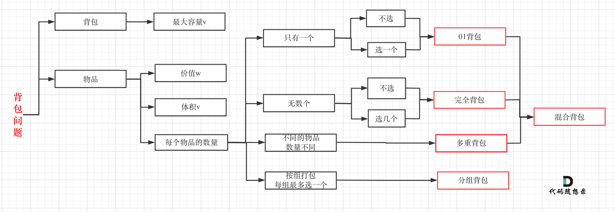
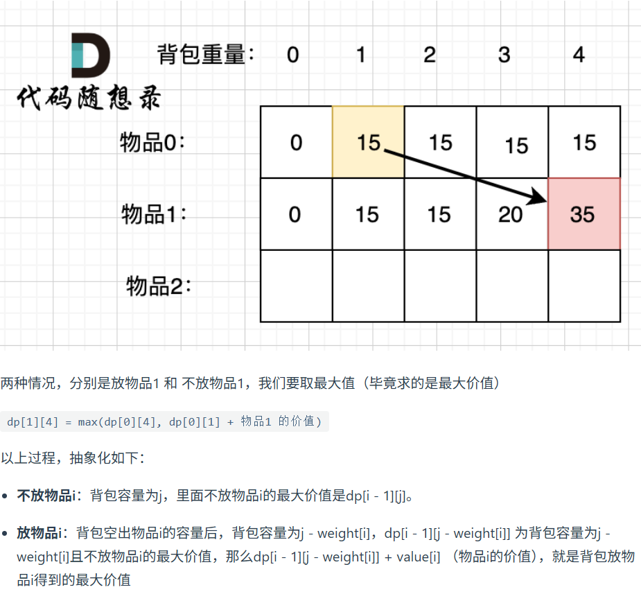

第九章 动态规划part03

正式开始背包问题，背包问题还是挺难的，虽然大家可能看了很多背包问题模板代码，感觉挺简单，但基本理解的都不够深入。 

如果是直接从来没听过背包问题，可以先看文字讲解慢慢了解 这是干什么的。

如果做过背包类问题，可以先看视频，很多内容，是自己平时没有考虑到位的。 

背包问题，力扣上没有原题，大家先了解理论，今天就安排一道具体题目。 


 详细布置 

# 01背包问题 二维 
https://programmercarl.com/%E8%83%8C%E5%8C%85%E7%90%86%E8%AE%BA%E5%9F%BA%E7%A1%8001%E8%83%8C%E5%8C%85-1.html  
视频讲解：https://www.bilibili.com/video/BV1cg411g7Y6  


- dp含义：当背包容量为j时，纳入考虑i以及i之前物品情况下，所能达到的最大价值
```
递推：当背包容量是j时，拿物品i过来考虑

如果清空背包都放不下：当无事发生，延续上一行的价值（dp[i-1][j]）
如果清空背包能放下：
- 要么维持背包，不考虑这件物品（dp[i-1][j]）
- 要么清空背包，先放这件物品,再在缝隙处放入一个目前考虑范围内的价值最大的小背包（总价值value[i]+dp[i-1][j-weight[i]]）
```
```Python
def find_max_value(m,n,weight,value):
    max_value = [[0]*(n+1) for _ in range(m)]  # 列数是n+1，因为前面多了一列空间0的状态
    # 初始化第一行
    for c in range(n+1):
        if c >= weight[0]: max_value[0][c] = value[0]
    # 递推
    for r in range(1,m): # 物品编号
        for c in range(n+1): # 背包容量
            # 如果倒空都放不下
            if weight[r] > c:
                max_value[r][c] = max_value[r-1][c]
            # 如果倒空能放得下
            else:
                max_value[r][c] = max(max_value[r-1][c],max_value[r-1][c-weight[r]]+value[r])
    print(max_value[-1][-1]) # acm模式需要print结果
```
# 01背包问题 一维 
https://programmercarl.com/%E8%83%8C%E5%8C%85%E7%90%86%E8%AE%BA%E5%9F%BA%E7%A1%8001%E8%83%8C%E5%8C%85-2.html  
视频讲解：https://www.bilibili.com/video/BV1BU4y177kY  

- 二维解法中的dp数组改1*（n+1）大小的，物品从头遍历，背包容量从后往前遍历（防止历史最大价值被提前覆盖，如果从左往右，那么在后面需要历史“缝隙小背包”的价值的时候就找不到了）
- 注意背包容量倒序更新dp数组的时候，范围得是range(n,wieght[i]-1,-1),确保是能放得下该物品的才开启这一轮更新
- ```dp[j] = max(dp[j], dp[j - weight[i]] + value[i])```

# 416. 分割等和子集  
本题是 01背包的应用类题目
https://programmercarl.com/0416.%E5%88%86%E5%89%B2%E7%AD%89%E5%92%8C%E5%AD%90%E9%9B%86.html    
视频讲解：https://www.bilibili.com/video/BV1rt4y1N7jE
- 等价为背包问题，每个数字是一个商品，重量和价值都是本身，能否装满重量sum/2的背包且价值也恰好是sum/2.
- 一维dp的做法同[01背包问题-一维](#01背包问题-一维)
```Python
def canPartition(self, nums: List[int]) -> bool:
    
    # 和为奇数
    if sum(nums)%2 == 1: return False

    # 一维dp初始化
    bag_room = sum(nums)//2
    max_value = [0]*(bag_room+1)
    for j in range(nums[0],bag_room+1):
        max_value[j] = nums[0]
    # 递推
    for i in range(1,len(nums)): # 遍历物品（数字）
        for j in range(bag_room,nums[i]-1,-1): # 倒序遍历背包容量,仅在能放下的部分更新，放不下的部分保持上一件物品考虑完之后的状态
            max_value[j] = max(max_value[j], max_value[j-nums[i]]+nums[i])
    return max_value[bag_room] == bag_room 
```


