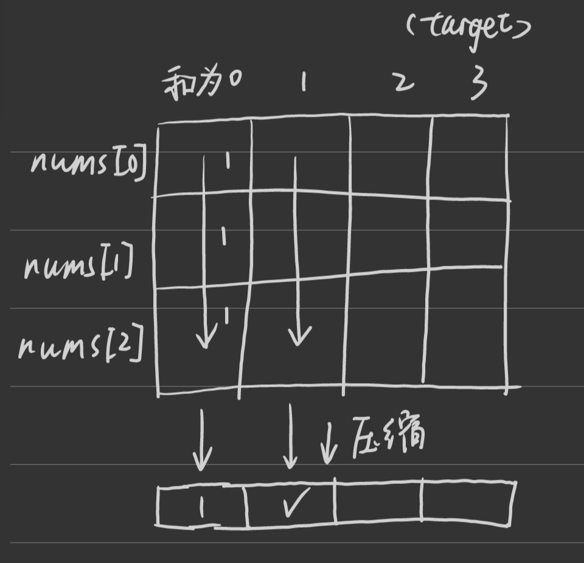

第九章 动态规划 part05
力扣上没有纯粹的完全背包的题目，我在卡码网上制作了题目，大家可以去做一做，题目链接在下面的文章链接里。

后面的两道题目，都是完全背包的应用，做做感受一下 

# 完全背包 
视频讲解：https://www.bilibili.com/video/BV1uK411o7c9
https://programmercarl.com/%E8%83%8C%E5%8C%85%E9%97%AE%E9%A2%98%E7%90%86%E8%AE%BA%E5%9F%BA%E7%A1%80%E5%AE%8C%E5%85%A8%E8%83%8C%E5%8C%85.html  
- 物品可以不限次数拿取
- 初始化：dp（m*（n+1）），第一行初始化尽量用最多的物品0填满容量,初始化逻辑类比递推逻辑

```
递推：当背包容量是j时，拿物品i过来考虑

如果清空背包都放不下：当无事发生，延续上一行的价值（dp[i-1][j]）
如果清空背包能放下：
- 要么维持背包，不考虑这件物品（dp[i-1][j]）
- 要么清空背包，先放1件这件物品,再在缝隙处放入一个本轮价值最大的缝隙背包。缝隙背包同样需要考虑放入这件物品，所以在考虑了这件物品的本轮中选取缝隙背包，而不是0-1背包中采用上一轮。（总价值value[i]+dp[i-1][j-weight[i]]）
```

```py
# 输入
mn = input().split()
m,n = int(mn[0]),int(mn[1])
weight,value = [0]*m,[0]*m
for i in range(m):
    wv = input().split()
    weight[i],value[i] =int(wv[0]),int(wv[1])

# dp初始化
max_value = [[0]*(n+1) for _ in range(m)]
# 第一行初始化逻辑类似后面的递推逻辑
for j in range(weight[0],n+1):
    max_value[0][j] = max_value[0][j-weight[0]] + value[0]

# 二维递推
for i in range(1,m):
    for j in range(1,n+1):
        if weight[i] <= j: # 装得下
            max_value[i][j] = max(max_value[i-1][j],max_value[i][j-weight[i]]+value[i])
        else: # 装不下
            max_value[i][j] = max_value[i-1][j]

print(max_value[-1][-1])
```

# 518. 零钱兑换 II  
视频讲解：https://www.bilibili.com/video/BV1KM411k75j
https://programmercarl.com/0518.%E9%9B%B6%E9%92%B1%E5%85%91%E6%8D%A2II.html  
- 是[494.目标和](./0731回溯.md)（0-1背包）对应的完全背包版本
- dp[i][j]: 考虑i以及i之前零钱种类时，凑够j总和的组合数。j==0的时候初始化为1，表示不装也是1中装法
```
 一维递推：

 如果总和能塞下该种零钱: dp[j] = dp[j-coins[i]] + dp[j]
 - 要么装1张和历史最新装缝隙背包（也就是本轮更新过的前面的背包，因为只有本轮才考虑过加入该种零钱），有dp[j-coins[i]]种组合；
 - 要么不装这一类零钱，有dp[j]种组合。

 如果总和装不下该种零钱：则不更新保留原最大组合值dp[j]
```
- 注意：和0-1背包的一维递推要按容量倒序更新有区别，**完全背包要考虑放过该物品的最新缝隙背包，所以本轮要按容量顺序遍历**更新获取最新的缝隙背包记录，而上一轮j容量的背包永远都在当前各自里，不会害怕丢失，要用到的时候一样可以使用

```py
def change(self, amount: int, coins: List[int]) -> int:

    # 初始化
    means_cnt = [0]*(amount+1)
    # 列先初始化,以便后续行初始化调用第一个非0值。行初始化可以省略因为和递推过程一致
    means_cnt[0] = 1
    
    # 递推
    for i in range(len(coins)): # 顺序遍历零钱种类
        for j in range(coins[i],amount+1): # 顺序遍历背包容量。装不下i类零钱的保留原装不需要经过遍历
            means_cnt[j] += means_cnt[j-coins[i]]
    return means_cnt[-1]
```
# 377. 组合总和 Ⅳ  
视频讲解：https://www.bilibili.com/video/BV1V14y1n7B6
https://programmercarl.com/0377.%E7%BB%84%E5%90%88%E6%80%BB%E5%92%8C%E2%85%A3.html

- 题意是不限次数取nums中的数去获得和为target的**排列**，（1,3）和（3,1）算两个。
- 如果**求组合数就是外层for循环遍历物品**，内层for遍历背包。
如果**求排列数就是外层for遍历背包**，内层for循环遍历物品。
- 完全背包问题，和[518.零钱兑换](#518-零钱兑换-ii)的区别在于：每个容量的背包都需要考虑所有的nums所组成的排列数量，所以需要**先对每个j遍历所有的i，确保每轮j结束后dp[-1][j]都是考虑了所有物品的。**
- dp[i][j]: 考虑i数字及之前数字情况下，和为j的所有排列的数量。和为0的都默认为1种排列，就是不取任何数

```
递推：考虑j容量的背包，对于该数字：
如果数字大于容量j（装不下）:则保持原排列数dp[j];
如果数字小于等于j(装得下)：
- 要么空出该数字的空间用遍历完所有物品的最新空隙背包填充再在后面补一个该数字，即dp[j-nums[i]]种排列
- 要么本轮容量就不多加1个该数字了，直接用最新的j容量背包的排列数，即dp[j]
```
```py
def combinationSum4(self, nums: List[int], target: int) -> int:
    # 初始化
    arrange_cnt = [0]*(target+1)
    arrange_cnt[0] = 1

    # 递推
    for j in range(1,target+1):          
        for i in range(len(nums)):
            if nums[i] <= j:
                arrange_cnt[j] += arrange_cnt[j-nums[i]]
    return arrange_cnt[-1]
```


# 70. 爬楼梯 （进阶） 

这道题目 爬楼梯之前我们做过，这次再用完全背包的思路来分析一遍 

https://programmercarl.com/0070.%E7%88%AC%E6%A5%BC%E6%A2%AF%E5%AE%8C%E5%85%A8%E8%83%8C%E5%8C%85%E7%89%88%E6%9C%AC.html  


