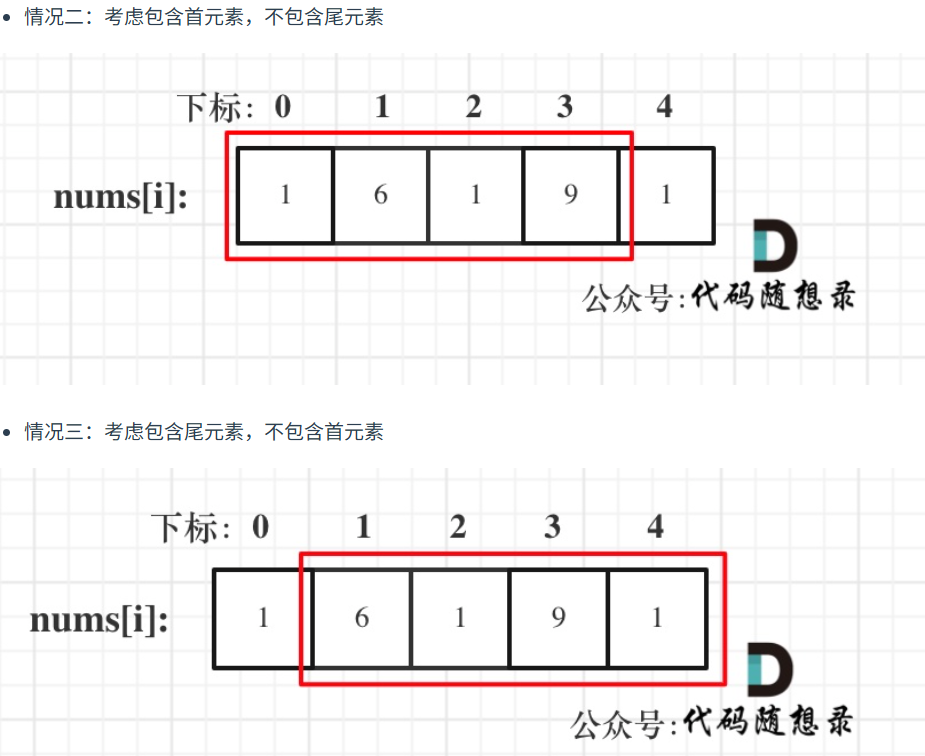

第九章 动态规划part07

 
今天就是打家劫舍的一天，这个系列不算难，大家可以一口气拿下。

# 198.打家劫舍  
视频讲解：https://www.bilibili.com/video/BV1Te411N7SX
https://programmercarl.com/0198.%E6%89%93%E5%AE%B6%E5%8A%AB%E8%88%8D.html  
- dp[i]: 房屋数量为i+1时能实现的最大金额
- 递推：dp[i] = max(dp[i-1],dp[i-2]+nums[i])，要跳出i家，要么偷到前一家不偷i，要么偷到前两家再偷i

```py
def rob(self, nums: List[int]) -> int:
    
    if len(nums) == 1: return nums[0]
    # 初始化
    max_value = [0]*(len(nums))
    max_value[0],max_value[1] = nums[0],max(nums[0],nums[1])
    # 递推
    for i in range(2,len(nums)):
        max_value[i] = max(max_value[i-1], max_value[i-2]+nums[i])
    return max_value[-1]
```

# 213.打家劫舍II  
视频讲解：https://www.bilibili.com/video/BV1oM411B7xq
https://programmercarl.com/0213.%E6%89%93%E5%AE%B6%E5%8A%AB%E8%88%8DII.html 

- 因为首尾两家不能同时偷，为了杜绝这个可能，所以在纳入考虑的时候就只纳入考虑其中一个（0到n-2、1到n-1），最后再取两种考虑范围内的最大值

```py
def rob(self, nums: List[int]) -> int:
    # 共n家。dp[i]表示房屋数量为i+1时，能偷的最大金额
    def get_maxvalue(nums):
        n = len(nums)
        max_value = [0]*n
        max_value[0],max_value[1] = nums[0],max(nums[0],nums[1])
        for i in range(2,n):
            max_value[i] = max(max_value[i-1], max_value[i-2]+nums[i])
        return max_value[-1]
    
    if len(nums) == 1: return nums[0]
    if len(nums) == 2: return max(nums)
    n = len(nums)
    result1 = get_maxvalue(nums[:n-1])
    result2 = get_maxvalue(nums[1:])
    return max(result1,result2)
```


# 337.打家劫舍III  
视频讲解：https://www.bilibili.com/video/BV1H24y1Q7sY
https://programmercarl.com/0337.%E6%89%93%E5%AE%B6%E5%8A%AB%E8%88%8DIII.html
- 递归+动态规划
- 后序遍历，考虑所有子树的情况才能决定当前节点所能达到的最大值
- 递归函数返回：dp=[不偷当前节点所能达到的最大值，偷当前节点所能达到的最大值]
- 递推：求当前节点的dp[0],也就是左右子树分别所达到的最大值之和，dp[0] = 左子树的max(dp) + 右子树的max(dp);求当前节点的dp[1],也就是求当前节点值再加上左右孙子树所能达到的最大值之和，后者等价于左子树不偷自己能达到的最大值+右子树不偷自己能达到的最大值，dp[1] = 左子树的dp[0] + 右子树的dp[0]
```py
class Solution:
    def rob(self, root: Optional[TreeNode]) -> int:
        
        def get_2_max(root):
            # 终止条件(注意，如果叶子节点，不能直接返回[0,0])
            if not root: 
                return [0,0]
            
            # 左、右子树所能达到的两类最大值
            left = get_2_max(root.left)
            right = get_2_max(root.right)
            # 如果不偷当前节点，所能达到最大值是
            dp1 = max(left) + max(right)
            # 如果偷当前节点，所能达到最大值是
            dp2 = root.val + left[0] + right[0]
            return [dp1,dp2]
        
        dp = get_2_max(root)
        return max(dp) # 最后返回的时根节点对应两种情况的最大值而不是dp列表，所以需要先调用再返回根节点dp最大值
```