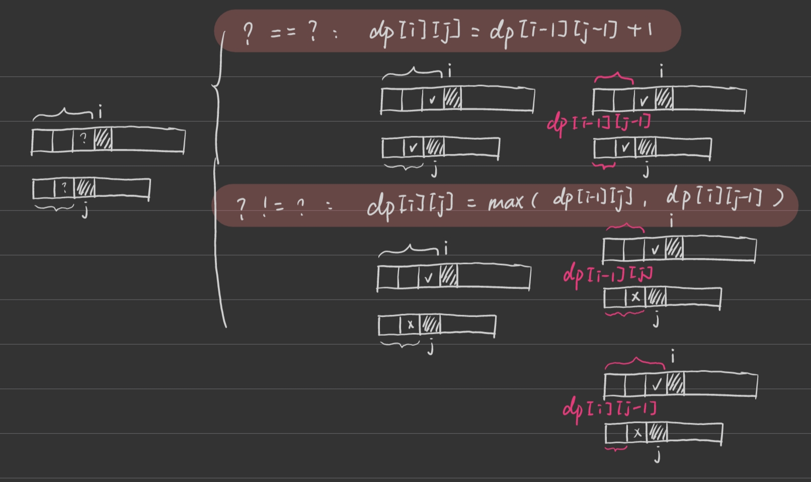
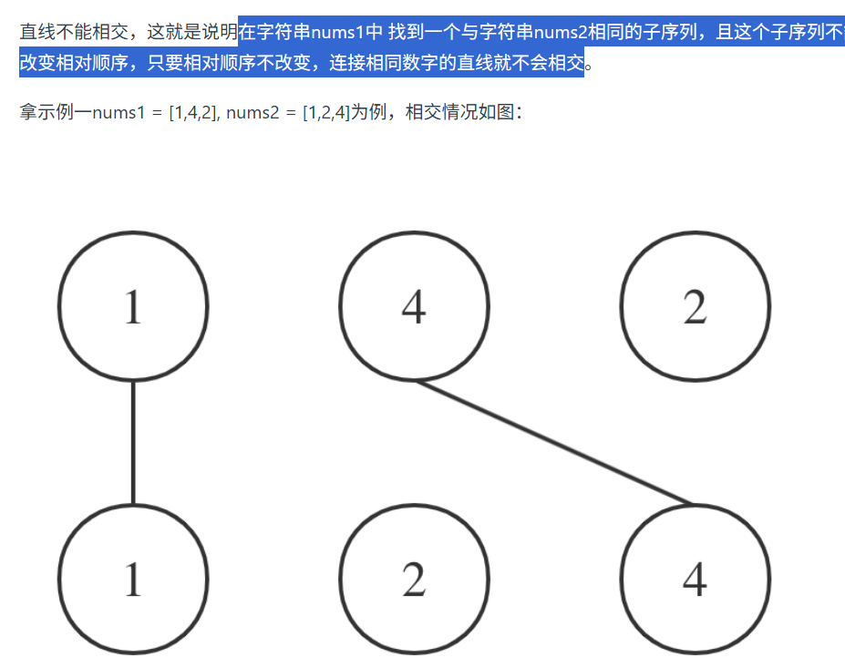

第九章 动态规划part11

# 1143.最长公共子序列 

体会一下本题和 [718. 最长重复子数组](./0820dp.md) 的区别  
视频讲解：https://www.bilibili.com/video/BV1ye4y1L7CQ
https://programmercarl.com/1143.%E6%9C%80%E9%95%BF%E5%85%AC%E5%85%B1%E5%AD%90%E5%BA%8F%E5%88%97.html
- 和 [718. 最长重复子数组](./0820dp.md) 的区别: 718.是连续不断地子数组，所以一旦子数组不以当前数字结尾则dp值变为0；本题是可以不连续的子序列，所以当前数字（i-1）只是“考虑”范围内的，要么前者+1要么前者取大。
- dp[i][j]: 考虑A[:i]和B[:j]子串【不含i、j】，所能达到的最长公共子序列（可以不连续）的长度。718.我自己的答案是以i、j结尾的公共子数组，这里是只考虑到i-1、j-1
- 递推：


```py
def longestCommonSubsequence(self, text1: str, text2: str) -> int:

    # 初始化
    longest_str = [[0]*(len(text2)+1) for _ in range(len(text1)+1)]
    # 二维递推
    for i in range(1,len(text1)+1):
        for j in range(1,len(text2)+1):
            if text1[i-1] == text2[j-1]:
                longest_str[i][j] = longest_str[i-1][j-1]+1
            else:
                longest_str[i][j] = max(longest_str[i-1][j],longest_str[i][j-1])
    return longest_str[-1][-1]
```

# 1035.不相交的线 

其实本题和 1143.最长公共子序列 是一模一样的，大家尝试自己做一做。
视频讲解：https://www.bilibili.com/video/BV1h84y1x7MP
https://programmercarl.com/1035.%E4%B8%8D%E7%9B%B8%E4%BA%A4%E7%9A%84%E7%BA%BF.html

等价于[1143.](#1143最长公共子序列)


# 53. 最大子序和 

这道题我们用贪心做过，这次 再用dp来做一遍 
视频讲解：https://www.bilibili.com/video/BV19V4y1F7b5
https://programmercarl.com/0053.%E6%9C%80%E5%A4%A7%E5%AD%90%E5%BA%8F%E5%92%8C%EF%BC%88%E5%8A%A8%E6%80%81%E8%A7%84%E5%88%92%EF%BC%89.html

# 392.判断子序列 

这道题目算是 编辑距离问题 的入门题目（毕竟这里只是涉及到减法），慢慢的，后面就要来解决真正的 编辑距离问题了

https://programmercarl.com/0392.%E5%88%A4%E6%96%AD%E5%AD%90%E5%BA%8F%E5%88%97.html

## 沿用 [1143.最长公共子序列](#1143最长公共子序列) 
- 由于s不可跳过，所以当i-1数不等于j-1数时，dp的更新不考虑用跳过i-1的dp[i-1][j]，直接用dp[i][j-1]

.jpg)
```py
def isSubsequence(self, s: str, t: str) -> bool:

    longest_str = [[0]*(len(t)+1) for _ in range(len(s)+1)]
    for i in range(1,len(s)+1):
        for j in range(1,len(t)+1):
            if s[i-1] == t[j-1]:
                longest_str[i][j] = longest_str[i-1][j-1] +1
            else:
                longest_str[i][j] = longest_str[i][j-1]
    return longest_str[-1][-1] == len(s)
```

## 指针
- 指针指向s，遍历t。遇到相同的，指针+1；不同的，看下一个t的字符。看最后指针是不是len(s)
- 注意一旦指针等于len(s)就退出循环，否则s[point]会越界
```py
def isSubsequence(self, s: str, t: str) -> bool:
    # 指针
    if not s: return True
    point = 0
    for i in t:
        point += s[point] == i
        if point == len(s):
            return True
    return False
```

  


