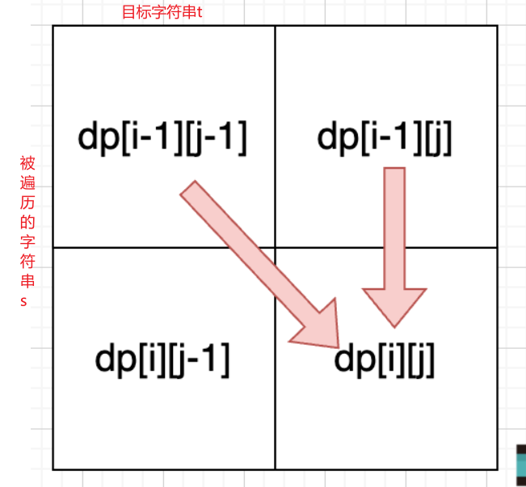
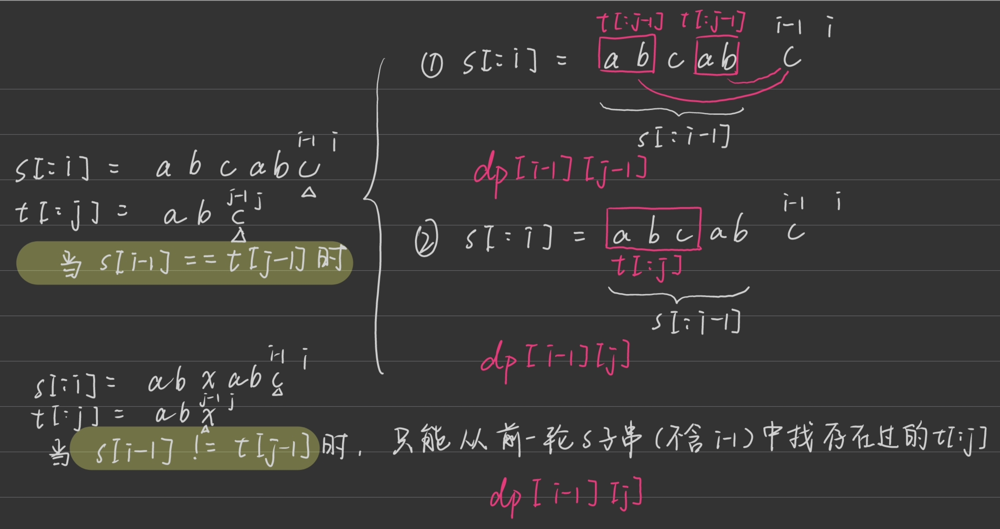

第九章 动态规划part12

# 115.不同的子序列 


https://programmercarl.com/0115.%E4%B8%8D%E5%90%8C%E7%9A%84%E5%AD%90%E5%BA%8F%E5%88%97.html

- 相对于 [392.判断子序列](./0821dp.md)的区别：本题求数量
- dp[i][j]: s[:i]（不含i）的子序列（可以删元素）等于t[:j](不含j)的个数。
- 递推：当俩子串**最后一个相同**时，s子串中的t子串分为两种，一种是s[:i-1]中那些t[:j-1]添上这个相同的字符得来，另一种是之前s[:i-1]就已经存在过的、现在要找的完整t[:j];如果俩子串**最后一个不同**，就没办法通过“添上”最后一个字符得到，只能是前面找过的完整的t[:j]
 



```py
def numDistinct(self, s: str, t: str) -> int:

    # 初始化
    subt_cnt = [[0]*(len(t)+1) for _ in range(len(s)+1)]
    # 第一行（第一个除外）全是0，空字符串里找t的子串找不到
    # 第一列全是1，s的每一个子串全部都删完，都能找到一个空字符串
    for i in range(len(s)+1):
        subt_cnt[i][0] = 1
    # 递推
    for i in range(1,len(s)+1):
        for j in range(1,len(t)+1):
            if s[i-1] == t[j-1]:
                subt_cnt[i][j] = subt_cnt[i-1][j-1] + subt_cnt[i-1][j]
            else:
                subt_cnt[i][j] = subt_cnt[i-1][j]
    return subt_cnt[-1][-1]
```

# 583. 两个字符串的删除操作 


https://programmercarl.com/0583.%E4%B8%A4%E4%B8%AA%E5%AD%97%E7%AC%A6%E4%B8%B2%E7%9A%84%E5%88%A0%E9%99%A4%E6%93%8D%E4%BD%9C.html

- 尝试套用 [1143.最长公共子序列长度](./0821dp.md)，最后**用两个字符串的长度减去两个最长子序列长度**
- dp[i][j]: word1[:i]和word2[:j]的最长公共子序列长度。如果当前i-1字符和j-1相同，左上角加一；如果不同，上面和左边取大

```py
def minDistance(self, word1: str, word2: str) -> int:

    # 初始化
    longest_str = [[0]*(len(word2)+1) for _ in range(len(word1)+1)]
    # 递推
    for i in range(1,len(word1)+1):
        for j in range(1,len(word2)+1):
            if word1[i-1] == word2[j-1]:
                longest_str[i][j] = longest_str[i-1][j-1] + 1
            else:
                longest_str[i][j] = max(longest_str[i-1][j],longest_str[i][j-1])
    print(longest_str[-1][-1])
    return len(word1)+len(word2)-2*longest_str[-1][-1]
```

# 72. 编辑距离 

最终我们迎来了编辑距离这道题目，之前安排题目都是为了 编辑距离做铺垫。 

https://programmercarl.com/0072.%E7%BC%96%E8%BE%91%E8%B7%9D%E7%A6%BB.html  
- dp[i][j]: word1[:i]变成word2[:j]所需的最小操作数。
- 递推：
```
如果当前的i-1和j-1的字符相同：
- 前一轮word1子串[:i-1]编辑成前一轮word2子串[:j-1]，这些操作用在[:i]，自然就变成了[:j]；（这里不考虑下面的①②情形，因为最后都得脱裤子放屁比最少的做法多一步）

如果不相同则有多种做法：
- ①前一轮word1子串[:i-1]直接编辑成本轮的[:j],这些操作用在[:i]得到了目标+一个i-1字符,然后再多一步把i-1字符删掉
- ②本轮word1子串[:i]先编辑成[:j-1],得到了少了最后一个字符的目标，然后再多一步把j-1字符加上去
- ③类比相同时的做法，前一轮[:i-1]编辑成前一轮[:j-1]，这些操作用在[:i]，得到只有最后一个字符和目标不同的字符串，然后再多一步把i-1换成j-1
```
```py
def minDistance(self, word1: str, word2: str) -> int:

    # 初始化
    min_steps = [[float('inf')]*(len(word2)+1) for _ in range(len(word1)+1)]
    # 第一行，空字符串变成word2的子字符串
    min_steps[0] = [i for i in range(len(word2)+1)]
    # 第一列，word1的子字符串变成空字符串
    for i in range(len(word1)+1):
        min_steps[i][0] = i
    # 递推
    for i in range(1,len(word1)+1):
        for j in range(1,len(word2)+1):
            if word1[i-1] == word2[j-1]:
                min_steps[i][j] = min_steps[i-1][j-1]
            else:
                min_steps[i][j] = min(min_steps[i-1][j]+1,min_steps[i][j-1]+1,min_steps[i-1][j-1]+1)
    return min_steps[-1][-1]
```

 编辑距离总结篇 
做一个总结吧
https://programmercarl.com/%E4%B8%BA%E4%BA%86%E7%BB%9D%E6%9D%80%E7%BC%96%E8%BE%91%E8%B7%9D%E7%A6%BB%EF%BC%8C%E5%8D%A1%E5%B0%94%E5%81%9A%E4%BA%86%E4%B8%89%E6%AD%A5%E9%93%BA%E5%9E%AB.html  

