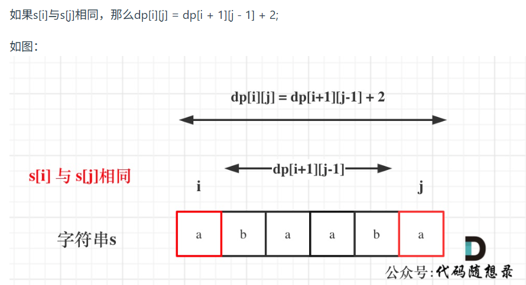
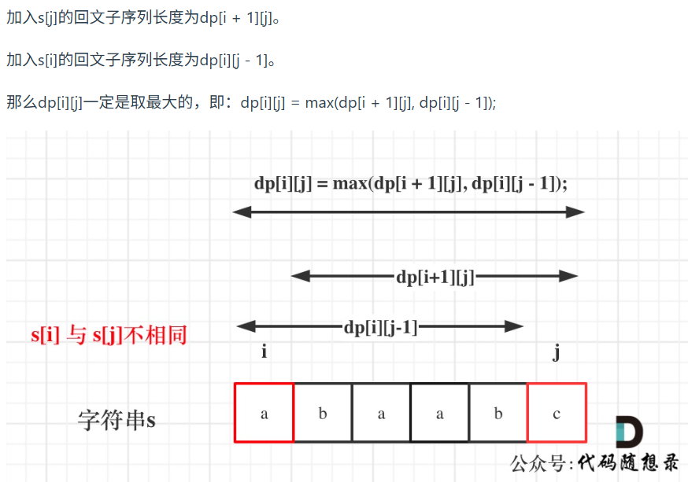
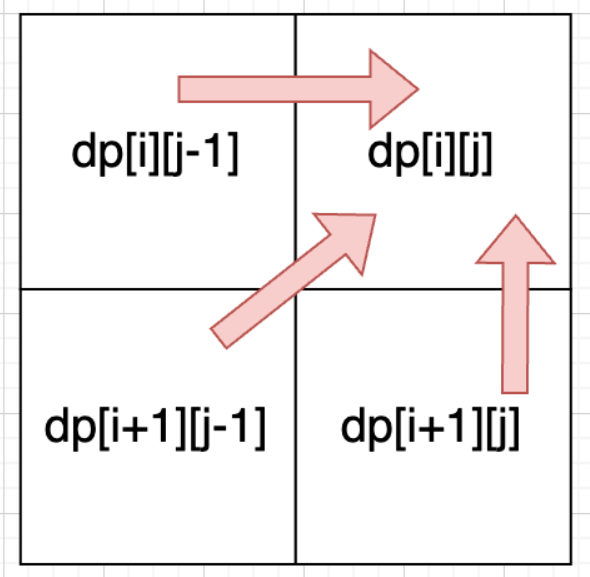
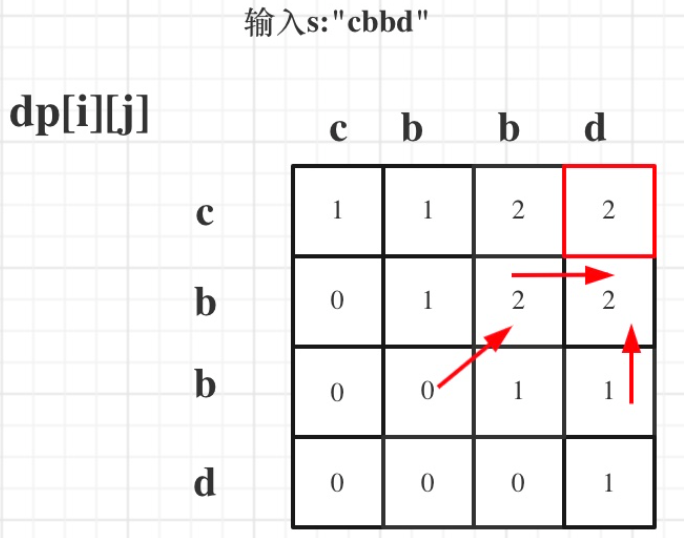

第九章 动态规划part13
今天 我们就要结束动态规划章节了，大家激不激动！！！ 

 详细布置 

# 647. 回文子串   

动态规划解决的经典题目，如果没接触过的话，别硬想 直接看题解。
https://programmercarl.com/0647.%E5%9B%9E%E6%96%87%E5%AD%90%E4%B8%B2.html  

- 和[131.分割回文串](./0731回溯.md)的区别：131.每一种分割后的所有成分子串都是回文串，本题只需要记录回文数量不要求剩余的字符串同样是回文串
- 双指针法
- 回文子串分为两种。一种是**以1个字母为中心向两边延伸**（长度为奇数），一种是**以2个字母为中心向两边延伸（长度为偶数）**。
- 从头到尾遍历s，分别以当前字符、当前字符和后一个字符作为中心向两边判断回文串并记录数量

```py
def countSubstrings(self, s: str) -> int:
    # 双指针法，每个中心（1个和2个字母）向两边延伸

    def is_substr(s,i,j):
        cnt = 0
        while i >= 0 and j < len(s):
            if s[i] == s[j]:
                cnt += 1
                i -= 1
                j += 1
            else: break      # 注意不相等的时候要break，否则死循环  
        return cnt    
    
    result = 0
    for i in range(len(s)):
        result += is_substr(s,i,i) + is_substr(s,i,i+1)
    return result
```

# 5.最长回文子串
- 子串，指不可删除其中元素的连续子字符串。做法借鉴[647.回文子串](#647-回文子串)
```py
def longestPalindrome(self, s: str) -> str:
    # 类似647
    def longest_str(s,i,j):
        longest_str = ''
        while i>=0 and j<len(s) and s[i] == s[j]:
            longest_str = s[i:j+1]
            i -= 1
            j += 1
        return longest_str
    
    result = ''
    for i in range(len(s)):
        str1 = longest_str(s,i,i)
        str2 = longest_str(s,i,i+1)
        curstr = str1 if len(str1) >= len(str2) else str2
        result = result if len(result) >= len(curstr) else curstr
    return result
```

# 516.最长回文子序列 

[647. 回文子串](#647-回文子串)，求的是回文子串，而本题要求的是回文子序列， 大家要搞清楚两者之间的区别。 
https://programmercarl.com/0516.%E6%9C%80%E9%95%BF%E5%9B%9E%E6%96%87%E5%AD%90%E5%BA%8F%E5%88%97.html 
- 子序列≠子串，子序列允许删减元素
- dp[i][j]: 以i字符开始以j字符结束的字符串s[i:j+1]的**最长**回文子序列
- 递归：


- 递归顺序：i从下到上，j从左到右。因为起点i不能大于终点j，所以只递推**dp数组右上半部分，只需要初始化对角线**即可。初始化为0矩阵

 

```py
def longestPalindromeSubseq(self, s: str) -> int:
    # 初始化矩阵。考虑到每一行第一个递推可能依赖于左下角的值，左下角应该满足“左下角”+2=2，所以统一初始化为0
    longest_str = [[0]*(len(s)) for _ in range(len(s))]
    # 初始化对角线为1
    for i in range(len(s)):
        longest_str[i][i] = 1

    # 二维递推。从下到上、从左到右。终点等于起点时已经初始化为1，j的递推从i+1开始
    for i in range(len(s)-1,-1,-1):
        for j in range(i+1,len(s)):
            if s[i] == s[j]:
                longest_str[i][j] = longest_str[i+1][j-1] + 2 # 当j==i+1时，'aa'最长回文长度为2，符合递推公式
            else:
                longest_str[i][j] = max(longest_str[i][j-1],longest_str[i+1][j])

    return longest_str[0][-1]

```

 动态规划总结篇 
https://programmercarl.com/%E5%8A%A8%E6%80%81%E8%A7%84%E5%88%92%E6%80%BB%E7%BB%93%E7%AF%87.html  
