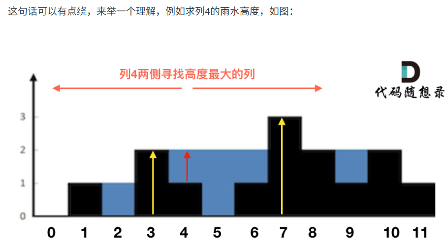

第十章 单调栈part02
 
# 42. 接雨水  

接雨水这道题目是 面试中特别高频的一道题，也是单调栈 应用的题目，大家好好做做。

建议是掌握 双指针 和单调栈，因为在面试中 写出单调栈可能 有点难度，但双指针思路更直接一些。

在时间紧张的情况有，能写出双指针法也是不错的，然后可以和面试官在慢慢讨论如何优化。



- 单调栈（按行计算雨水面积）做法比较复杂，使用左右最高数组（按列计算雨水面积）做法较简单
- 遍历每一个位置，**其（含）左边最高和其（含）右边最高的两者的“短板”-自己高度=自己位置这一列的雨水面积**
- 从左往右遍历记录每个位置的左边（含本身）最高高度，**从右往左遍历记录**每个位置的右边（含本身）最高高度
- 从左往右遍历每个位置，收集每个位置上的雨水列
```py
def trap(self, height: List[int]) -> int:

    left_highest,right_highest = [height[0]]*len(height),[height[-1]]*len(height)
    # left
    for i in range(1,len(height)): # 当前比前一个的历史记录还高，则更新为当前
        left_highest[i] = max(left_highest[i-1],height[i])
    # right，倒序
    for i in range(len(height)-2,-1,-1):
        right_highest[i] = max(right_highest[i+1],height[i])
    # 收集雨水列
    result = 0
    for i in range(len(height)):
        result += min(left_highest[i],right_highest[i]) - height[i]
    return result

```

# 84.柱状图中最大的矩形
有了之前单调栈的铺垫，这道题目就不难了。 

https://programmercarl.com/0084.%E6%9F%B1%E7%8A%B6%E5%9B%BE%E4%B8%AD%E6%9C%80%E5%A4%A7%E7%9A%84%E7%9F%A9%E5%BD%A2.html

- 思路：类似接雨水的栈做法。栈口向右，栈内维持爬升阶梯状。栈顶、栈顶的前一个、待入栈构成矩形的最大高度、右边限位器（不属于矩形）、左边限位器（不属于矩形）
- heights前后要添加0，且要提前入栈第一个0

```py
def largestRectangleArea(self, heights: List[int]) -> int:
    
    heights.insert(0,0)
    heights.append(0)
    stack = [0]
    result = 0
    for i in range(1,len(heights)):
        while stack and heights[i] < heights[stack[-1]]:
            h = heights[stack.pop()]
            if stack:
                result = max(result,h*(i-stack[-1]-1))
        stack.append(i) # 不管有没有符合while条件都要把当前i入栈
    return result
```
